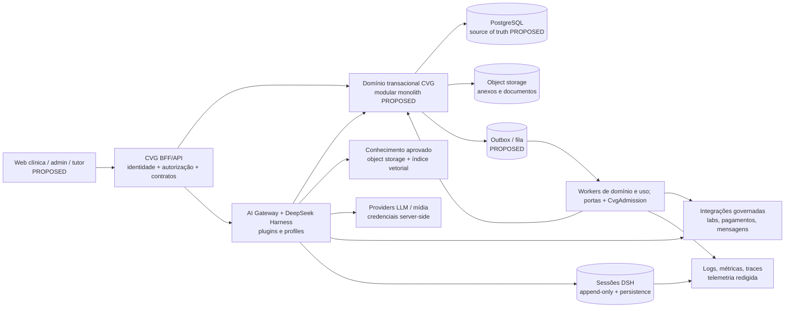
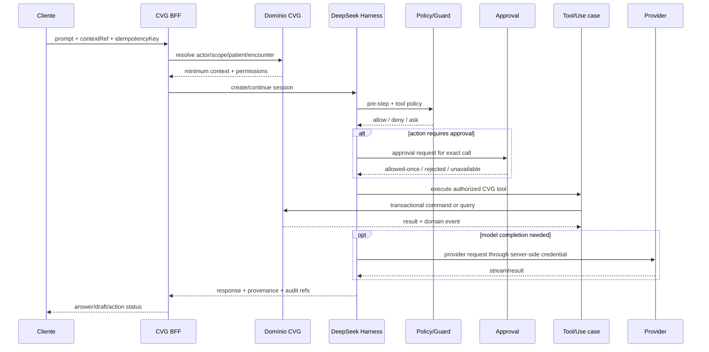

# CVG-Corp — Arquitetura-alvo

**Estado:** TARGET/PROPOSED; arquitetura para aprovação técnica e operacional.

**Perfil:** o produto CVG é tratado como greenfield documental; o DeepSeek Harness é uma dependência brownfield existente, em developer preview, com commit local fixado na fase.

**Profundidade:** T3 System para múltiplos limites e milestones, com controles T4 nos caminhos de dados clínicos, identidade, medicação, pagamentos, credenciais e ações irreversíveis.

## 1. Decisões arquiteturais orientadoras

1. O domínio transacional do CVG é a fonte de verdade de pacientes, tutores, agenda, prontuário, exames, internação, estoque, cobrança e auditoria de negócio.
2. O DeepSeek Harness é o motor de sessões, contexto, tools, approvals, automações e agentes; ele não é a fonte primária do registro clínico, do saldo de estoque ou do ledger financeiro.
3. A primeira topologia proposta é um modular monolith para o domínio, com API/BFF, runtime de IA e workers separados por processo; microsserviços ficam condicionados a isolamento de falha, escala, ownership ou requisito de deployment demonstrado.
4. Toda chamada percorre um contexto de organização, unidade, workspace, usuário, paciente e atendimento quando aplicável; ausência de contexto obrigatório falha fechado.
5. Uma ferramenta é uma capability governada, não uma função que o modelo pode chamar por nome; o servidor verifica actor→action→resource→condition antes de executar.
6. Eventos de domínio representam fatos do CVG; eventos e sessões do DeepSeek representam execução do agente. A ponte entre eles é explícita, correlacionada e idempotente.
7. O caminho manual permanece disponível para operações críticas quando modelo, provider, rede, busca vetorial ou runtime estiverem indisponíveis.

O recorte confirmado atende somente o CVG, preparado para várias unidades; `organizationId` continua sendo fronteira de autorização, sem cadastro de empresas externas. A primeira entrega é M1 local sintético, conforme [08](08-rastreabilidade-e-decisoes.md#fechamento-confirmado-em-2026-09-08); a topologia completa abaixo não precisa ser instanciada nessa entrega.

## 2. Mapa lógico



O worker não possui conexão direta com PostgreSQL, object store, vector store ou outro store clínico. A seta `W → DOM` representa a chamada de caso de uso/porta de domínio com `CvgAdmission`, contexto, autorização, idempotência e auditoria; a seta `W → X` só ocorre pelo adapter e `IntegrationContract` governados. Qualquer fila, lock ou store técnico próprio do worker precisa ser classificado separadamente e não pode virar fonte de verdade clínica.

As tecnologias de persistência são propostas a partir dos vídeos, não uma decisão de compra ou implantação. A escolha final deve considerar operação, backup, residência, custo, suporte e evidência de carga.

## 3. Limites de contexto

Os limites abaixo são semânticos e de ownership. Eles não obrigam um processo ou pacote separado.

| Contexto | Dono da verdade | Expõe | Não decide |
|---|---|---|---|
| Identidade, organização e policy | usuários, sessões de identidade, unidades, equipes, roles e policies | contexto autenticado, escopo e decisões de autorização | conteúdo clínico, saldo ou preço sozinho |
| Tutor e paciente | tutores, responsáveis, pacientes, identificadores e vínculos | busca segura e resolução de identidade | diagnóstico, agenda ou cobrança |
| Agenda e capacidade | serviços, profissionais, salas, equipamentos, leitos reserváveis e reservas | disponibilidade, fila e check-in | conteúdo de prontuário |
| Atendimento e prontuário | encontros, observações, avaliação, plano, assinatura, adendos e anexos | fatos clínicos estruturados e timeline | autorização de pagamento ou tool por si só |
| Diagnóstico | pedidos, amostras, resultados, laudos e revisão | cadeia pedido→amostra→resultado | interpretação clínica final |
| Internação e procedimentos | episódios, leitos, tarefas, monitoramento, procedimentos, handoffs e alta | estado operacional e pendências | prescrição sem contexto clínico |
| Terapêutica e medicação | ordens, administração, suspensão, omissão e instruções | fatos de tratamento e execução | estoque físico fora dos movimentos |
| Estoque e suprimentos | itens, lotes, validade, localizações, movimentos e fornecedores | saldo e rastreabilidade | prescrever ou editar prontuário |
| Financeiro | orçamento, cobrança, pagamentos, estornos e conciliação | ledger e estado financeiro | alterar conduta clínica |
| Comunicação | destinatário, consentimento, template, mensagem, entrega e falha | mensagens e status de entrega | inferir consentimento ou enviar sem policy |
| Conhecimento e memória | documentos aprovados, versões, chunks, embeddings e memória de sessão | contexto com fontes e escopo | transformar contexto em fato canônico |
| AI Gateway / Harness | agente, sessão, prompt, tools, model, approval, budget e execução | rascunhos, ações e proveniência | ser o sistema clínico ou financeiro |
| Integrações e auditoria | outbox/inbox, correlacionamento, eventos, auditoria e reconciliação | efeito externo e evidência | mascarar erro ou confirmar sem retorno válido |

## 4. Dependências e direção

```text
interface/client
    -> BFF/remote contract
        -> application use cases
            -> domain contexts
                -> repositories + transactional database
            -> outbox/inbox
                -> integrations/workers

AI surface
    -> CVG AI gateway
        -> DeepSeek Harness Service Definitions and Consumers
            -> policy/guards -> approval -> tool execution
                -> CVG application use cases
        -> LLM providers / knowledge / integrations
```

O domínio não importa o loop concreto do harness. A camada CVG deve consumir contratos estáveis e montar plugins/consumers; a troca de provider, modelo ou backend de sessão não deve alterar regras clínicas.

## 5. Aplicações e processos propostos

| Processo | Responsabilidade | Estado |
|---|---|---|
| `cvg-clinical-web` | Recepção, atendimento, internação, farmácia e consulta com UX orientada ao papel. | PROPOSED |
| `cvg-admin-web` | Usuários, unidades, roles, policies, catálogo, budget, conhecimento, integrações e auditoria. | PROPOSED |
| `cvg-tutor-portal` | Agenda, consentimento, documentos e comunicação liberados ao tutor. | PROPOSED/P2 |
| `cvg-bff` | Autenticação de sessão, autorização, API/remote, streaming e projeções. | PROPOSED |
| `cvg-domain` | Casos de uso e invariantes transacionais por contexto. | PROPOSED |
| `cvg-ai-gateway` | Composição do profile/bundle, sessões, contexto, policies, tools e approvals. | PROPOSED |
| `cvg-worker` | Outbox, reconciliação, budget, notificações, indexação e automações. | PROPOSED |
| `cvg-integrations` | Adaptadores de laboratório, imagem, pagamentos, mensagens e calendário. | PROPOSED |
| `cvg-ops` | Migrações, backup, health, métricas, alertas, auditoria e runbooks. | PROPOSED |

Os nomes são identificadores de planejamento, não diretórios existentes. A implementação futura deve preservar a ownership mesmo que a organização física mude.

## 6. Composição do motor

O profile CVG proposto é uma composição de camadas, seguindo a arquitetura documentada do DeepSeek Harness:

```text
cvg-profile
  -> dsh-base                         CURRENT capability in engine
  -> dsh web/headless host as needed  CURRENT capability, deployment choice
  -> cvg-identity-policy              PROPOSED CVG plugin
  -> cvg-context-patient              PROPOSED CVG plugin
  -> cvg-tool-read-domain             PROPOSED CVG tools
  -> cvg-tool-draft-clinical          PROPOSED CVG tools
  -> cvg-tool-action-domain           PROPOSED, approval + guard required
  -> cvg-knowledge                    PROPOSED CVG provider/consumer
  -> cvg-budget-usage                 PROPOSED CVG consumer/worker bridge
  -> cvg-audit-session                PROPOSED CVG event/telemetry bridge
  -> cvg-integrations                 PROPOSED allowlisted consumers
  -> profile/home overlays            CURRENT composition mechanism
```

O `dsh-base`, os profiles, os eventos e as seams listadas acima existem na documentação do motor; os itens com prefixo `cvg-` são extensões propostas. A profile não deve montar tools de shell, filesystem ou web por padrão para o agente clínico; cada inclusão precisa de justificativa, sandbox, egress e policy.

## 7. Mapeamento de capacidades do DeepSeek Harness

| Necessidade CVG | Ponto documentado do motor | Proveniência | Uso proposto | Limite |
|---|---|---|---|---|
| Provider/modelo | `ctx.llm` e adapters | `SRC-DSH-01` | Selecionar modelo por policy/tenant/workspace e medir uso. | O motor não escolhe a política clínica sozinho. |
| Sessão e replay | `ctx.sessions`, session log, persistence | `SRC-DSH-02` | Registrar prompt, resposta, tool/result, aprovação e recuperação. | Sessão não vira prontuário assinado. |
| Contexto/instruções | `ctx.systemPrompt`, `agent.inject()` | `SRC-DSH-01` | Montar contexto mínimo com origem e escopo. | O que chega ao modelo precisa ser logável; limitar PHI/PII por desenho. |
| Tools | `ctx.tools` e `tools/*` | `SRC-DSH-03` | Registrar schemas de leitura, rascunho e ações. | Output, timeout, cancelamento, guard e policy devem ser explícitos. |
| Aprovação | `ctx.approval` | `SRC-DSH-04` | Responder `ask` para ação específica e registrar resultado. | `allowed-once` não substitui role, alçada ou consentimento. |
| Sandbox | `ctx.sandbox`, `ctx.sandboxPolicy`, `ctx.fs` | `SRC-DSH-06` | Confinar ferramentas de arquivo/processo quando existirem. | Não é isolamento total de DB, rede, plugin in-process ou provider. |
| Credenciais | `ctx.credentials`, `ctx.authorization` | `SRC-DSH-05` | Referenciar e resolver secrets por operação no gateway. | Nunca enviar chave ao cliente ou ao prompt. |
| Jobs/workflows | `ctx.jobs`, `ctx.workflowEngine` | `SRC-DSH-07` | Jobs de resumo, indexação, follow-up e relatórios. | Movimentos clínicos/financeiros continuam sob transação do CVG. |
| Subagentes | `ctx.subagents` | `SRC-DSH-08` | Especialistas isolados para tarefas de baixo risco e síntese. | Não delegar ato clínico final; `agent-team` experimental não é P0. |
| Telemetria | `ctx.sessionTelemetry` | `SRC-DSH-10` | Métricas e logs redigidos de sessão/uso. | Telemetria não deve substituir auditoria transacional. |
| API remota | `ctx.remote`/Typert gateway | `SRC-DSH-09` | BFF entre cliente e host, se adotado. | Contratos CVG precisam de autenticação, escopo, erro e versão próprios. |

## 8. Fluxo de uma solicitação de IA



O request id, session id, tool token, domain command id e approval id devem permanecer correlacionados sem misturar identidades. Resultado de uma tool que falhou, foi cancelada ou ficou desconhecida não pode ser apresentado como sucesso.

## 9. Persistência e materialização

- PostgreSQL é a escolha `PROPOSED` para entidades e invariantes transacionais, com `tenant_id`, `organization_id`, `unit_id` e escopos necessários em cada tabela.
- Object storage compatível com S3/MinIO é `PROPOSED` para documentos, imagens, laudos, áudio e anexos; o banco guarda metadados, hash, classificação, origem e autorização.
- Qdrant ou serviço vetorial equivalente é `PROPOSED` para conhecimento e memória derivada; toda consulta carrega filtros de tenant, unidade, workspace e política.
- O DeepSeek Harness persiste sessões por backend próprio e conserva o log append-only necessário para replay. A ponte salva apenas referências e resultados de domínio necessários, sem duplicar o prontuário inteiro.
- Outbox/inbox é `PROPOSED` para garantir durabilidade e deduplicação: a mutação de domínio e o registro de outbox do produtor, ou o registro de inbox e o efeito local do consumidor, entram na mesma transação local; somente relay, publicação e `ack` acontecem depois do commit.

### Atomicidade de outbox/inbox

O produtor grava o fato de domínio e seu `OutboxRecord` na mesma transação ACID. O relay só publica registros já commitados e pode repetir a entrega. O consumidor grava a chave de inbox, aplica o efeito local e atualiza sua projeção na mesma transação; só confirma o recebimento ao broker depois desse commit. Uma queda antes do commit não deixa fato sem evento nem evento sem efeito; uma queda depois do commit deixa apenas uma entrega repetível. A deduplicação não substitui a transação local e nenhum adapter pode declarar sucesso antes do receipt ou da reconciliação prevista.

## 10. Limites de confiança

1. Cliente não confiável → BFF autenticado: validar input, sessão, origem, tamanho e versão.
2. BFF → domínio: só contratos internos tipados, autorização central e transação.
3. Harness → tools CVG: input do modelo é não confiável; guard monotônico e autorização por recurso.
4. Harness → provider: credencial server-side, egress allowlist, timeout, limite de payload e redaction.
5. Harness → documento/web/MCP: conteúdo é dado não confiável, nunca policy.
6. Worker → domínio/externos: identidade de serviço mínima, idempotência, retry controlado e reconciliação.
7. Admin/suporte → dados clínicos: acesso excepcional temporário, motivo, aprovação e auditoria.
8. Plugin in-process → runtime: código admitido é confiável por processo; pacote, hash, origem e revisão devem ser controlados antes da montagem.

## 11. Restrições e decisões ainda abertas

- O motor local está em developer preview; upgrades podem quebrar contratos e devem ser tratados como mudança de dependência com replay e smoke test.
- O runtime não garante por si só segregação organizacional; o BFF, domínio e cada tool precisam aplicar escopo.
- O sandbox do motor cobre efeitos de arquivo de processos confinados, não uma política completa de rede, banco ou privilégio clínico.
- A escolha web versus desktop, quantidade de offline e modelo de deployment depende da decisão U14 do PRD.
- `agent-team` aparece como experimental na documentação do motor e fica fora do caminho clínico P0 até ter gate próprio.
- A arquitetura só entra em `TECHNICALLY_SPECIFIED` depois de congelar contratos, dados, failure behavior, segurança, compatibilidade, recuperação e testes nas decisões U1–U15.

## 12. Contrato mínimo de integrações

Cada adapter externo deverá ser especificado como uma instância do contrato abaixo; uma lista de “integrações suportadas” não é contrato suficiente.

```text
IntegrationContract {
  integrationId, owner, purpose, sourceOfTruth,
  serviceIdentity, credentialRef, allowedScopes,
  endpointAndRegion, apiVersion, requestSchema, responseSchema,
  webhookSchemaAndSignature, idempotencyKey,
  timeout, retryBudget, backoff, cancellation,
  outcomeUnknownQuery, reconciliationProcedure,
  dataClasses, providerRetentionPolicy,
  errorMapping, quarantineRule, auditFields, killSwitch
}
```

| Integração candidata | Comando/evento CVG | Identidade e escopo | Efeito, incerteza e reconciliação | Estado |
|---|---|---|---|---|
| Laboratório/imagem | `DiagnosticRequest` → `Result` | conta de serviço por unidade/contrato; credencial referenciada; paciente/pedido/amostra no escopo | `externalOrderId` e `specimenId` são idempotentes; webhook assinado; timeout consulta status; resultado incompatível vai para quarentena | `PROPOSED/NOT_RUN` |
| Pagamento | `Charge`/`Refund` → webhook de liquidação | conta de serviço financeira, merchant/tenant explícito e alçada separada | `paymentIntentId` evita duplicidade; webhook assinado e fora de ordem é deduplicado; resposta perdida vira `OUTCOME_UNKNOWN` e reconciliação, nunca segundo débito cego | `PROPOSED/NOT_RUN` |
| Mensageria | `SendApprovedCommunication` → receipt/status | remetente/canal por unidade, consentimento e template aprovados | `messageId`/idempotency key, destinatário verificado, status consultável; falha não significa entrega; conteúdo sensível exige approval | `PROPOSED/NOT_RUN` |
| Calendário | `Appointment` → confirmação/cancelamento | integração limitada à agenda e recursos autorizados; source of truth a decidir | chave de reserva, versão e reconciliação de conflito; indisponibilidade deixa `PENDING_EXTERNAL` sem marcar presença como confirmada | `PROPOSED/NOT_RUN` |
| Provider LLM/mídia | turn/tool request → usage/receipt | gateway server-side, `credentialRef`, modelo/region allowlist e `ProviderTransferPolicy` | request id, reservation id e usage; timeout separa efeito de negócio de consumo; late usage congela budget e abre reconciliação | `PROPOSED/NOT_RUN` |

As instâncias de schema abaixo são contratos CVG propostos, não nomes ou versões confirmados dos fornecedores:

| Adapter | Request e fonte da verdade | Response/webhook versionado | Erro/quarentena | Reconciliação |
|---|---|---|---|---|
| Laboratório/imagem | `DiagnosticOrder.v1 {diagnosticRequestId, patientId, encounterId, specimenId, items, priority, callbackRef}`; domínio CVG é a fonte do pedido | `LabResult.v1 {externalOrderId, specimenId, resultVersion, analytes, attachments, status}`; `LabResultAvailable.v1` com assinatura | `AUTH_INVALID`, `SCHEMA_INVALID`, `SPECIMEN_MISMATCH`, `DUPLICATE`, `TIMEOUT`; mismatch/assinatura inválida → `QUARANTINED` | consultar por `externalOrderId + specimenId`; só `ResultReview` autorizado promove o fato |
| Pagamento | `PaymentIntent.v1 {chargeId, organizationId, amount, currency, idempotencyKey, returnRef}`; ledger CVG é fonte financeira | `PaymentReceipt.v1 {providerPaymentId, status, amount, providerVersion}`; `PaymentEvent.v1` assinado | `AUTH_INVALID`, `AMOUNT_MISMATCH`, `DUPLICATE`, `TIMEOUT`, `UNKNOWN`; divergência → `RECONCILIATION_REQUIRED` | consultar `providerPaymentId`, comparar ledger e gravar movimento compensatório; nunca duplicar débito |
| Mensageria | `MessageDispatch.v1 {messageId, recipientRef, consentRef, templateVersion, approvedContentDigest, channel}`; CVG é fonte de autorização | `MessageReceipt.v1 {providerMessageId, acceptedAt}`; `DeliveryEvent.v1` assinado | `RECIPIENT_MISMATCH`, `CONSENT_MISSING`, `TEMPLATE_RETIRED`, `RATE_LIMIT`, `TIMEOUT` | consultar status por `providerMessageId`; sem receipt, status permanece não enviado/unknown |
| Calendário | `AppointmentSync.v1 {appointmentId, resourceId, startsAt, endsAt, version, idempotencyKey}`; source of truth será decidido em U8 | `CalendarReceipt.v1 {externalEventId, version, status}`; `CalendarEvent.v1` assinado quando houver callback | `CONFLICT`, `VERSION_STALE`, `AUTH_INVALID`, `TIMEOUT`; conflito não altera presença | buscar por `appointmentId`, comparar versão e reconciliar manualmente se ambas as fontes mudaram |
| Provider LLM/mídia | `ProviderTurn.v1 {actionId, commandId, idempotencyKey, modelVersion, artifactBinding, contextDigest, reservationId, payloadRef}`; CVG é fonte de policy/budget | `ProviderResponse.v1 {providerRequestId, contentRef, finishState}` + `ProviderUsage.v1` | `POLICY_DENIED`, `CREDENTIAL_INVALID`, `PAYLOAD_LIMIT`, `TIMEOUT`, `USAGE_UNKNOWN` | consultar request/usage pela chave estável e pelo provider request id quando possível; late usage entra no ledger hold e não vira efeito clínico |

Cada schema será versionado no registry de contratos, com codec, campos obrigatórios, limite de tamanho, classificação e testes de unknown field. Até existir implementação e contrato real do fornecedor, estes nomes permanecem `PROPOSED/NOT_RUN`.

Regras comuns para todos os adapters: aceitar somente schema/version permitidos; validar assinatura e origem antes de mutar; persistir a mutação de domínio junto com o outbox do produtor ou o inbox/efeito local do consumidor na mesma transação; publicar e confirmar recebimento somente depois do commit; usar idempotência por efeito; limitar timeout/retry; mapear `UNKNOWN`, `QUARANTINED` e `RECONCILIATION_REQUIRED`; registrar `integrationId`, versão, credencial referenciada, request/receipt/audit IDs; e possuir kill switch sem apagar evidência. Nenhum webhook, texto do provider ou retorno de tool pode alterar policy, role ou aprovação.

Os campos numéricos de timeout, retry, retenção e janela de compatibilidade permanecem `UNKNOWN` até U8/U12/U14 e contrato com cada fornecedor. A especificação executável e os testes de resposta perdida, duplicidade, assinatura falsa, ordem invertida e revogação são `NOT_RUN`.

## 13. Stack recomendada para M1 local

**Estado:** aprovada para M1 local em DEC-M1-04; scaffold e lockfile implementados em B1, com provas e limites em 07. Sem aceite de produção.

| Parte | Escolha | Motivo e alternativa |
|---|---|---|
| Linguagem/runtime | TypeScript em Node 24, ESM; npm workspaces | Uma linguagem entre cliente, domínio e futura ponte Harness. Node `24.20.0` e npm `11.19.0` foram observados localmente. |
| Interface | React com Vite, SPA | Fluxo autenticado local não exige SSR; manter apresentação separada do domínio. |
| API | Fastify 5, schemas JSON de entrada/saída | API pequena e explícita; regras nos casos de uso, não em componentes React. |
| Banco | PostgreSQL 18; driver `pg`, SQL parametrizado e migrations SQL versionadas | Manter as transações e restrições previstas; SQLite não substitui a prova de locks/concorrência do banco-alvo. |
| Sessão | `@fastify/cookie` + `@fastify/session`, store PostgreSQL | Cookie com referência à sessão; autoridade sempre resolvida no servidor. Não usar o store em memória padrão. |
| Testes | Runner nativo Node para domínio/API/integração; Playwright para navegador | Integração usa PostgreSQL real isolado e fixtures sintéticas; mock de banco não comprova concorrência. |
| Topologia | `apps/web`, `apps/api`, `packages/domain`, `packages/contracts`, `db/migrations` | API serve o build web em uma origem; desenvolvimento usa proxy `/api`. Sem Redis, workers ou Harness em M1. |

Node/npm acima são versões observadas, não prova de compatibilidade do conjunto. Fixar versões exatas de dependências, plugins, TypeScript, navegador e imagem PostgreSQL no primeiro scaffold, com `package-lock.json` e digest da imagem; verificar engines/peer dependencies e instalação limpa. Não executar instaladores com `latest` como baseline reproduzível. A seleção por linha principal está feita; resolução de patches e smoke test permanecem tarefas de scaffold.

Ambiente observado: `docker` e `psql` não encontrados no PATH. Caminho recomendado é PostgreSQL isolado via Compose com porta somente em loopback; instalar/preparar o runtime de containers será uma tarefa de ambiente separada. Não foi executada instalação nem acessado banco externo.

Referências oficiais consultadas em 2026-09-08: [Fastify LTS](https://fastify.dev/docs/latest/Reference/LTS/), [Vite](https://vite.dev/guide/), [sessões Fastify](https://github.com/fastify/session), [transações com pg](https://node-postgres.com/features/transactions), [política de versões PostgreSQL](https://www.postgresql.org/support/versioning/). São evidências das ferramentas; a adequação ao recorte é julgamento de projeto e ainda exige prova no artifact.
