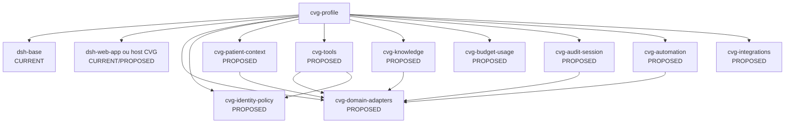

# CVG-Corp — DeepSeek Harness como motor de agentes

**Estado:** CURRENT capability map + TARGET/PROPOSED adapter design.

Este documento define o uso do `deepseek-harness` como motor plugável. A existência de uma seam, pacote ou evento no motor não significa que um adapter CVG já exista.

## 1. Envelope atual do motor

O repositório local está em `6454e3270642c3a7551dcae4f7447e4032febd77`, manifesto `0.1.1-rc.2`, ESM, Node `^22.19.0 || >=24.0.0` e postura developer preview. A documentação do motor declara que tudo é plugin Cordis: serviços entram no contexto, eventos tipados comunicam e registros são efeitos reversíveis.

O motor oferece profile/bundle com patches ordenados. O `dsh-base` compõe a fundação; `web` e `headless` são modos de superfície; overlays de profile/home/CLI podem substituir rows. O programa CVG deve fixar uma versão compatível e validar a composição efetivamente carregada antes de produção; nenhum `--dump-config` foi executado nesta fase.

## 2. Grafo de composição proposto



`cvg-*` são nomes de planejamento. Um bundle pode montar vários plugins, mas cada capability precisa de um Service Definition, Provider e Consumer quando houver variação independente. O profile não deve alterar o loop concreto para adicionar comportamento CVG.

## 3. Matriz seam→uso

| Capacidade DeepSeek | Estado no motor | Proveniência | Adapter CVG proposto | Regra de uso |
|---|---|---|---|---|
| `ctx.llm` | CURRENT documentado | `SRC-DSH-01` | `cvg-llm-policy`/provider configuration | Resolver provider por request e credencial por operação; não expor segredo. |
| `ctx.agents` | CURRENT documentado | `SRC-DSH-01` | `cvg-agent-factory` | Criar/resumir Agent com owner, tenant, workspace e session link explícitos. |
| `ctx.agentLoop` | CURRENT concrete driver | `SRC-DSH-01` | Consumir seam, não patchar | Alteração do loop exige atualização de arquitetura e regressão ampla. |
| `ctx.systemPrompt` | CURRENT documentado | `SRC-DSH-01` | `cvg-prompt-context` | Montar policy, papel, contexto mínimo e formato de citação; conteúdo model-visible deve ser logado. |
| `agent.inject()` | CURRENT documentado | `SRC-DSH-01` | avisos/contexto do domínio | Injeta somente mensagem identificada, com origem e finalidade; nunca usa texto de documento como policy. |
| `ctx.sessions` | CURRENT documentado | `SRC-DSH-02` | `cvg-session-bridge` | Sessão append-only para interação, replay e tool results; `flush` é checkpoint, não prontuário. |
| `ctx.tools.register()` | CURRENT documentado | `SRC-DSH-03` | `cvg-tool-*` | Registrar cada tool com schema de input/output, apresentação, log projection e cancelamento. |
| `tools/pre-execute` | CURRENT waterfall | `SRC-DSH-03` | `cvg-tool-policy` | Avaliar contexto, role, ação, recurso, estado, budget e egress; negar por default. |
| `ctx.tools.guard()` | CURRENT monotonic guard | `SRC-DSH-03` | `cvg-clinical-guard`/`cvg-finance-guard` | Proibir que listener posterior ou approval transforme uma negação em permissão. |
| `ctx.tools.execute()` | CURRENT pipeline | `SRC-DSH-03` | wrappers CVG de timeout/metrics/idempotência | O efeito final deve ser um comando de domínio, não uma mutação direta feita pelo modelo. |
| `ctx.tools.post-execute` | CURRENT waterfall | `SRC-DSH-03` | `cvg-result-policy` | Redigir resultado, anexar referências e bloquear conteúdo inadequado; não confundir content replacement com confidentiality. |
| `ctx.approval` | CURRENT fail-closed | `SRC-DSH-04` | `cvg-approval-adapter` | Approval pontual para args/resource/estado exatos; `unavailable` é deny. |
| `ctx.credentials` | CURRENT reference/provider | `SRC-DSH-05` | `cvg-credential-provider` | Referenciar credencial; resolver no gateway por operação; nunca persistir valor em policy/prompt/log. |
| `ctx.authorization` | CURRENT flow | `SRC-DSH-05` | adapters OAuth/API | Uma tentativa por chave; rotação/revogação deve ter registro. |
| `ctx.sandbox` | CURRENT process seam | `SRC-DSH-06` | `cvg-process-policy` | Somente para processo/arquivo que realmente exista; `partial` não pode ser tratado como isolamento absoluto. |
| `ctx.jobs` | CURRENT package family | `SRC-DSH-07` | `cvg-job-consumers` | Relatórios, indexação e follow-up; movimentos clínicos/financeiros continuam no domínio. |
| `ctx.workflowEngine` | CURRENT optional seam | `SRC-DSH-07` | automações P1 | Limitar duração, execução, subagentes e side effects; `dispose` e cancelamento precisam de prova. |
| `ctx.subagents` | CURRENT providers | `SRC-DSH-08` | especialistas de baixo risco | Cada child recebe escopo mínimo; nenhum child assina, prescreve, dispensa ou liquida. |
| `ctx.agentTeams` | EXPERIMENTAL | `SRC-DSH-08` | não usar em P0 | Só após gate próprio de isolamento, concorrência, persistência e auditoria. |
| `ctx.sessionTelemetry` | CURRENT optional | `SRC-DSH-10` | `cvg-telemetry-sink` | Telemetria redigida e best-effort; auditoria crítica fica fora dela. |
| `ctx.remote`/Typert | CURRENT API layer | `SRC-DSH-09` | BFF quando validado | Wire transporta snapshots/IDs e erros estáveis; não expõe objetos live ou initiator como auth. |

## 4. Contexto e sessão

O fluxo documentado é `turn/start → agent/pre-step → step → agent/request → llm/stream → assistant/message → tool/call → tools/* → tool/result → step/end → turn/end`. O log de sessão pode existir em memória e/ou persistência conforme o backend montado; `flush` é o checkpoint que precisa ser confirmado antes de tratar um evento como fisicamente persistido. Waterfalls e eventos live são pontos de extensão.

O CVG deve registrar em cada sessão:

- identidade do ator e owner do Agent;
- organização, unidade, workspace e finalidade;
- paciente e atendimento apenas quando necessários e autorizados;
- versão do profile, policy, prompt, ferramenta e modelo;
- referências de dados consultados, sem duplicar o prontuário inteiro;
- approval, budget reservation, command id e audit id;
- motivo de falha, cancelamento, retry ou `OUTCOME_UNKNOWN`.

`Session` é append-only e seu histórico de modelo é derivado. `user/message`, `assistant/message` e `tool/result` são model-visible; qualquer dado que chegue ao modelo precisa ser reconstruível pelo log. Como o log canônico não é reescrito pela redaction de telemetria, o adapter deve minimizar dados clínicos antes de criar a mensagem.

Uma sessão em memória não equivale a persistência física. Após eventos críticos ou antes de concluir uma operação que depende de replay, o bridge usa `ctx.sessions.flush(session)` e distingue `accepted-in-log` de `durably-persisted`.

## 5. Catálogo de agentes CVG

Cada agente é um preset de capacidades e prompt, não uma role de segurança. A autorização continua no domínio e nos guards.

| Preset | Pode consultar | Pode propor | Não pode executar autonomamente |
|---|---|---|---|
| `cvg-frontdesk` | tutor, paciente mínimo, agenda, fila e status financeiro mínimo | confirmação, lembrete, rascunho de mensagem | alteração clínica, desconto fora de alçada, exportação ampla |
| `cvg-clinical-scribe` | contexto clínico do atendimento, documentos e resultados autorizados | resumo, campos ausentes, rascunho SOAP/alta | diagnóstico final, prescrição, assinatura, comunicação |
| `cvg-nursing-ops` | tarefas, ordens, leitos, monitoramento e handoff atribuídos | checklist, handoff, alerta operacional | alterar ordem, assinar decisão reservada, inventário fora da ordem |
| `cvg-pharmacy-stock` | itens, lotes, validade, ordens e consumo | alerta de ruptura/validade, rascunho de compra | dispensar sem ordem/policy, ajuste silencioso, saldo negativo |
| `cvg-finance-ops` | orçamento, ledger, pagamentos e reconciliação permitidos | explicação e relatório | estorno, desconto fora de alçada, alteração clínica |
| `cvg-quality-admin` | métricas agregadas e auditoria autorizada | análise de tendência, plano de melhoria | acessar prontuário individual sem break-glass |
| `cvg-platform-admin` | configuração de plataforma e status técnico | policy/catálogo global | acessar conteúdo clínico por padrão |

O preset deve usar escopo de Agent para composição e visibility de tools; essa restrição de apresentação não é uma fronteira de autoridade. Uma tool local pode existir só para o Agent, mas ainda precisa de autorização server-side.

## 6. Política em cascata

A política `PROPOSED` é monotônica e só permite restrição ao descer de escopo:

```text
platform baseline
  -> organization policy
    -> unit policy
      -> workspace policy
        -> role/actor policy
          -> session approval state
```

Uma camada inferior pode remover provider, modelo, tool, destino, dado ou ação; não pode reintroduzir o que uma camada superior proibiu. Ausência de policy, versão expirada, hash divergente, cache corrompido ou contexto incompleto produz `POLICY_DENIED`.

`ctx.tools.restrict()` é apenas composição de visibilidade; o desenho não o trata como controle de segurança. A decisão final é uma guard/porta de domínio que conhece ator, recurso, estado, condição e versão de policy.

## 7. Tipos de tools e approval

| Nível | Exemplo | Política proposta |
|---|---|---|
| T0 leitura | agenda disponível, paciente já resolvido, estoque por local | role + escopo + policy; sem approval se estritamente read-only |
| T1 rascunho | resumo clínico, e-mail, alta, relatório | grava `AiDraft`; revisão humana antes de publicar |
| T2 efeito reversível | criar reserva, tarefa, rascunho de cobrança, lembrete | approval contextual quando houver destinatário/efeito externo |
| T3 alto impacto | assinar, prescrever, dispensar, registrar administração, alterar saldo, estornar, enviar informação sensível | role de alçada + estado válido + approval forte; em alguns casos segunda pessoa |
| T4 irreversível/privilegiado | exclusão, exportação ampla, break-glass, troca global de policy/credencial | ação fora do Agent clínico; autoridade explícita, janela, motivo, auditoria e revalidação |

O approval do motor retorna somente `allowed-once`, `rejected`, `cancelled` ou `unavailable`; `allowed-once` autoriza uma nova execução no caminho `NEW_EXECUTION`, não uma consulta ao resultado de uma execução já registrada no caminho `REPLAY_LOOKUP`. O adapter CVG acrescenta um `ApprovalBinding` com hash dos argumentos normalizados, recurso, versão esperada, policy revision, actor approver, expiração, finalidade, alçada e vínculo à execução/idempotency record. Se qualquer item mudar entre approval e uma nova execução, o comando é rejeitado e precisa de nova decisão.

O hash usa canonicalização determinística `UTF-8 + JSON sem whitespace`, chaves ordenadas recursivamente, números em representação única, listas preservando ordem, campos opcionais explicitamente ausentes/nulos conforme schema e rejeição de campos desconhecidos. O digest inclui `action`, `resource`, `expectedVersion`, `scope`, `egressIntent`, `policyRevision/hash`, `credentialRef/version`, `budgetReservationId`, `artifactBinding` e `expiresAt`; não é calculado a partir do texto exibido na UI.

Estados propostos do binding: `ISSUED → DECIDED → CONSUMING → CONSUMED`, ou `REJECTED`, `EXPIRED`, `REVOKED`, `CONFLICT`. `CONSUMING` é reservado atomicamente para a primeira execução por `approvalId + digest`; uma nova execução com outra chave recebe `APPROVAL_REPLAY`. Isso não transforma uma repetição idempotente em nova execução: a chave estável é consultada e reivindicada antes do consumo do binding.

```text
IdempotencyLookupKey {
  organizationId: VALUE,
  unitId: VALUE|ABSENT, workspaceId: VALUE|ABSENT,
  actorId: VALUE, commandType: VALUE,
  resourceType: VALUE, resourceId: VALUE|ABSENT,
  idempotencyKey: VALUE,
  lookupKeyCanonical, lookupKeyHash: NOT_NULL_UNIQUE
}

IdempotencyRecord {
  lookupKey, lookupKeyCanonical, lookupKeyHash, idempotencyKey,
  originalActionId, originalCommandId, actorId,
  organizationId, unitId?, workspaceId?, commandType, scopeDigest,
  normalizedArgsDigest, resourceRef, expectedVersion?,
  approvalBindingId?, budgetReservationId?, dispatchIntentId?,
  status: ADMISSION_PENDING|IN_FLIGHT|SUCCEEDED|FAILED|OUTCOME_UNKNOWN,
  dispatchState: NOT_STARTED|INTENT_DURABLE|SEND_STARTED|RECEIPTED|UNKNOWN,
  failurePhase?, failureCode?, claimEpoch, claimExpiresAt,
  resultRef?, receiptRef?, resourceVersion?, createdAt, updatedAt
}
```

`IdempotencyLookupKey` é derivada no servidor a partir da identidade autenticada, do escopo efetivo, do tipo de comando e da chave fornecida pelo cliente. Cada posição é codificada no `lookupKeyCanonical` como um valor tipado: `VALUE("x")` ou o marcador estrutural `ABSENT`; ausência nunca é SQL `NULL`, string vazia ou coluna omitida, e `VALUE("ABSENT")` não se confunde com o marcador. `lookupKeyHash` é o hash dos bytes canônicos e é uma coluna `NOT NULL UNIQUE`; a comparação do canonical completo resolve qualquer colisão de hash. Se a implementação também mantiver colunas decompostas anuláveis, deve usar `UNIQUE NULLS NOT DISTINCT` ou equivalente, além da chave canônica não anulável. Os campos `unitId?`, `workspaceId?` e demais opcionais mantidos no registro são projeção/consulta, não participam sozinhos da unicidade. Assim, o índice server-scoped representa igualdade de ausência para `(organizationId, unitId, workspaceId, actorId, commandType, resourceType, resourceId, idempotencyKey)` sem depender da semântica padrão de `NULL` do PostgreSQL, que trata nulos como distintos por padrão em uma constraint `UNIQUE` e permite alterar isso com `NULLS NOT DISTINCT` conforme a [documentação oficial de constraints do PostgreSQL](https://www.postgresql.org/docs/current/ddl-constraints.html).

`actionId` não participa da busca: ele identifica a execução originalmente reivindicada e é persistido em `originalActionId`; uma nova requisição pode receber outro `actionId` de transporte, mas recupera os identificadores originais e o mesmo receipt. O registro também conserva `scopeDigest`, recurso, versão e argumentos normalizados para detectar conflito. A chave do cliente não é global nem substitui autenticação ou autorização.

A criação/reivindicação `ADMISSION_PENDING` é uma transação preparatória protegida por `lookupKeyHash` e `claimEpoch`. Depois que a admissão passa, comando interno promove o registro, consome o binding e muta o domínio na mesma transação; efeito externo persiste `DispatchIntent`/`dispatchState` antes do envio. Crash entre intent e envio é reconciliado pelo provider, nunca repetido cegamente. Approval do engine sem `ApprovalBinding` CVG válido é `DENIED`.

Há dois caminhos de admissão, com um preâmbulo comum de decode/schema, canonicalização, resolução da identidade autenticada, escopo efetivo, revogação e finalidade:

1. `REPLAY_LOOKUP` — revalidar a autorização atual para ler o receipt/resultado e o recurso referenciado; então buscar a `IdempotencyRecord` pela `IdempotencyLookupKey` estável e comparar `scopeDigest`, argumentos, recurso e `expectedVersion`. Se houver registro compatível, devolver `receiptRef`/`resultRef`, `originalActionId`, `originalCommandId` e o mesmo status `IN_FLIGHT`/`OUTCOME_UNKNOWN`/final. Para `ADMISSION_PENDING` ainda dentro do lease, devolver `ADMISSION_IN_PROGRESS` com `claimExpiresAt`; se o lease expirou, acionar o reconciliador antes de decidir o resultado. Este caminho não reserva budget, não consulta registry para executar, não consome approval, não resolve credencial e não despacha novamente. Se a autorização de leitura atual falhar, retorna `DENIED` sem revelar o registro; se a chave existir com digest incompatível, retorna `IDEMPOTENCY_CONFLICT` sem consumir approval.
2. `NEW_EXECUTION` — quando o lookup não encontra registro, autorizar a ação sobre o recurso/estado e reivindicar atomicamente a `IdempotencyLookupKey` com os digests, os identificadores originais, `status=ADMISSION_PENDING`, `dispatchState=NOT_STARTED`, `claimEpoch` e lease curto. Somente o claimant com esse `claimEpoch` continua com registry/revision/digests, budget reservation, binding de approval, credencial, egress e chamada da porta de domínio. Uma corrida que perca a reivindicação volta ao `REPLAY_LOOKUP`. Ausência de registry, budget, approval, credencial ou policy é finalizada como `FAILED` pré-dispatch e não há envio.

Assim, recuperar o resultado existente exige apenas as condições atuais para leitura protegida do resultado; credencial, egress e as condições para produzir um novo efeito pertencem exclusivamente à admissão completa. `APPROVAL_REPLAY` fica reservado para uma nova execução, não para recuperar o resultado da mesma execução.

### 7.2 Reivindicação abandonada antes do dispatch

Uma negação depois da reivindicação, mas antes de qualquer dispatch, faz um compare-and-set de `ADMISSION_PENDING + claimEpoch` para `FAILED`, com `failurePhase=PRE_DISPATCH`, `dispatchState=NOT_STARTED` e código determinístico (`REGISTRY_DENIED`, `BUDGET_DENIED`, `APPROVAL_DENIED`, `CREDENTIAL_DENIED` ou equivalente). A reserva de budget não consumida é liberada/expirada; approval não consumida não é consumida, e approval já consumida não é reutilizada. O registro falho permanece para que a mesma chave devolva a mesma negação; uma nova execução exige nova `idempotencyKey` e nova admissão.

Um reconciliador de claims varre registros com `ADMISSION_PENDING` e `claimExpiresAt` vencido. Ele primeiro invalida o `claimEpoch` antigo. Se `dispatchIntentId` estiver ausente e `dispatchState=NOT_STARTED`, finaliza a reivindicação como `FAILED` com `failurePhase=PRE_DISPATCH` e `failureCode=CLAIM_ABANDONED`, sem executar a tool. Se houver intent ou qualquer sinal de envio, não faz rollback: marca `OUTCOME_UNKNOWN`/`dispatchState=UNKNOWN` e consulta o provider. Somente uma confirmação externa de que não houve envio permite finalizar como `FAILED` `PRE_DISPATCH_NOT_SENT`; sem essa evidência, o efeito é incerto e permanece em reconciliação. Um worker antigo, com `claimEpoch` inválido, não pode promover, despachar ou alterar o registro.

O teste obrigatório injeta crash imediatamente após a reivindicação e cobre: retry durante o lease (`ADMISSION_IN_PROGRESS`), expiração sem intent (`FAILED/CLAIM_ABANDONED`), negação de registry/budget/approval/credencial (`FAILED/PRE_DISPATCH`), intent com provider desconhecido (`OUTCOME_UNKNOWN`) e concorrência com todos os campos opcionais ausentes. O teste deve provar que não há segunda reivindicação nem dispatch automático a partir de `ADMISSION_PENDING`.

### 7.1 Admission comum para toda tool

Para evitar bypass por superfície, toda chamada originada por tool nativa, tool local, MCP, skill, Code Mode, subagente ou integração remota deve chegar à mesma porta `CvgToolAdmission`/`CvgCommandAdmission`. `ctx.tools.restrict()` controla visibilidade; não substitui esta decisão. O sandbox controla apenas os efeitos que realmente cobre; não é autorização de tenant ou clínica.

```text
ActionEnvelope {
  actionId, commandType, actionClass, actorId, actorKind,
  securityContextDigest, organizationId, unitId?, workspaceId?,
  resourceType, resourceId, expectedVersion?, purpose,
  normalizedArgsDigest, policyRevision, policyHash,
  credentialRef?, egressIntent?, idempotencyKey,
  budgetReservationId, approvalBindingId?, artifactBinding,
  registryRevision, deadline, parentActionId?
}
```

O envelope é montado e validado no servidor; o modelo não pode declarar `actorId`, escopo, role, `commandType`, approval, credencial, registry ou digest de artefato como autoridade. A classificação de conteúdo não confiável ocorre antes de qualquer decisão. O preâmbulo comum resolve identidade, escopo, revogação e finalidade e então bifurca explicitamente para `REPLAY_LOOKUP` ou `NEW_EXECUTION`, conforme o protocolo acima. O `actionId` é correlação da tentativa; a identidade estável da repetição é a `IdempotencyLookupKey`, e os IDs originais são recuperados do registro. Nenhum fluxo alternativo por tool, MCP, skill, Code Mode, subagente ou integração remota pode pular essa bifurcação.

| Origem | Tratamento obrigatório | Limite adicional |
|---|---|---|
| Tool nativa/local | schema + guard + `ActionEnvelope` + porta de domínio | não chamar banco/HTTP diretamente |
| MCP | admission CVG antes e depois do transporte, egress allowlist e trust level | descrição/nome/resultado MCP são untrusted; não recebem autoridade |
| Skill/plugin | hash, versão, owner, dependências e registry admitido | plugin in-process é código confiável do processo, não sandbox |
| Code Mode | processo/policy próprios, mesma authz/budget/egress e output normalizado | não ganha `full-access` nem bypass por código gerado |
| Subagente/nested call | herda o contexto e recebe sub-reserva; pode somente restringir | nunca amplia role, escopo, tool, budget ou approval do parent |
| BFF/remote direto | `CommandEnvelope` passa pela mesma policy e domínio | transporte não é identidade e não cria um caminho alternativo |

Negação em qualquer fase é auditável por `actionId`/`correlationId`; conteúdo recebido depois não pode transformar `DENIED` em `ALLOW`. O teste de bypass para cada origem permanece `NOT_RUN`.

## 8. Budget e consumo

O budget deve reservar capacidade antes do turno e registrar consumo depois de cada request/tool. A unidade definitiva — moeda, créditos, tokens e unidades de mídia — é `UNKNOWN`; a arquitetura exige ledger de consumo separado do saldo exibido.

`UsageRecord` inclui tenant, workspace, actor, session, step, tool/model, provider request id, input/output usage quando disponível, mídia, retry, status, estimated/final cost, currency, policy revision e idempotency key. A consolidação em lote pode atrasar a visão, mas não pode transformar atraso em crédito ilimitado.

Chamadas aninhadas, Code Mode, retries e providers sem usage precisam de budget reservation e reconciliação. Em caso de incerteza, bloquear novo efeito caro e abrir reconciliação; não confiar na média do token meter.

### Reserva atômica e hard stop

O contrato de budget usa dimensões independentes para não esconder consumo de uma modalidade:

```text
BudgetReservation {
  reservationId, parentReservationId?, organizationId, workspaceId, actorId,
  sessionId, actionId, policyRevision, dimensions,
  upperBound, reservedAt, expiresAt, status, idempotencyKey
}

dimensions = {
  money, inputTokens, outputTokens, audioSeconds, imageUnits,
  transcriptionSeconds, providerCalls, toolDispatches, externalEffects
}
```

1. Antes de qualquer provider, mídia, transcrição, MCP, retry, Code Mode ou efeito externo, o gateway calcula um `upperBound` ou rejeita por não conseguir estimar com segurança.
2. A reserva raiz é atômica por `organizationId/workspaceId/actorId` e cada nested call só pode consumir uma sub-reserva da raiz. A mesma `idempotencyKey` devolve a reserva existente; parâmetros incompatíveis geram `IDEMPOTENCY_CONFLICT`.
3. O admission repete o hard check imediatamente antes do dispatch. Ao atingir o limite, novos dispatches são negados; não há crédito implícito por atraso de batch, retry ou saldo de interface.
4. O settlement atualiza a tentativa e registra usage observado, custo estimado/final, provider request id, receipt, retry e discrepância; libera sobra somente depois de confirmar o estado permitido. Uma tentativa pode gerar vários lançamentos, um por modalidade ou correção.
5. Uso tardio, duplicado ou acima da reserva entra em `BUDGET_RECONCILIATION_HOLD`, congela novos efeitos caros do escopo afetado e exige reconciliação. Nunca produzir saldo negativo silencioso nem contar o mesmo provider event duas vezes.

### Ledger de uso e settlement

O ledger é append-only lógico e separado do saldo apresentado na UI:

```text
UsageAttempt {
  attemptId, reservationId, parentReservationId?, actionId, attemptNumber,
  organizationId, workspaceId, actorId, sessionId,
  providerRequestId?, idempotencyKey,
  state: RESERVED|DISPATCHED|SETTLED|UNKNOWN|RECONCILIATION_HOLD,
  occurredAt, receivedAt?, causationId, auditId
}

UsageLedgerEntry {
  usageEntryId, attemptId, reservationId, actionId,
  entryType: RESERVATION|OBSERVED|RELEASE|COMPENSATION,
  modality, unit, quantity,
  estimatedCost?, finalCost?, currency?, occurredAt, receivedAt,
  providerUsageEventId?, causationId, auditId
}

ProviderUsageEvent {
  providerUsageEventId, providerRequestId?, providerEventKey,
  attemptId?, modality, quantity, occurredAt, receivedAt,
  payloadDigest, rawReference?
}
```

`UsageAttempt` representa a identidade de uma tentativa; `UsageLedgerEntry` representa seus lançamentos append-only. Portanto, `(reservationId, actionId, attemptNumber)` é único somente em `UsageAttempt`, enquanto um mesmo attempt pode possuir vários lançamentos para tokens, áudio, imagem, chamadas ou compensações. `providerEventKey` é único no escopo do provider quando presente; `providerRequestId`/`providerUsageEventId` também são deduplicados quando fornecidos. A `idempotencyKey` é única na operação/registro de idempotência com seu escopo explícito, não em cada posting do ledger.

Reentregar o mesmo provider event retorna o evento e o settlement já associado sem criar novo lançamento. Um novo evento ou modalidade legítima cria outro `UsageLedgerEntry` ligado ao mesmo `attemptId`; correção, liberação e compensação também são lançamentos novos e nunca alteram os anteriores. `DISPATCHED` sem usage confirmado vira `UNKNOWN`; usage tardio ou fora de ordem não reescreve o passado, gera lançamento compensatório se necessário e transita para `RECONCILIATION_HOLD`. A reconciliação compara reserva, attempt, provider events, lançamentos e cobrança; divergência mantém o escopo em hold e exige owner, motivo, decisão e `AuditRecord`. Crash entre reserva, dispatch e settlement deve ser recuperado por replay idempotente, não por dedução temporal.

Os preços, moeda e limites numéricos são `UNKNOWN`; a atomicidade, cobertura das dimensões e comportamento de hard stop são requisitos `PROPOSED` que precisam de ledger executável e teste de crash/late/out-of-order antes do gate.

## 9. Conhecimento, memória e conteúdo não confiável

O CVG mantém três camadas diferentes:

1. **Conhecimento aprovado:** políticas, manuais, protocolos e documentos versionados, com ACL e vigência.
2. **Memória de sessão/workspace:** preferências e contexto derivados, sujeitos a finalidade e retenção própria.
3. **Prontuário e domínio:** fatos clínicos e operacionais canônicos, escritos apenas por casos de uso autorizados.

O retrieval deve filtrar escopo antes da busca, devolver fonte/versão/trecho e marcar documentos, e-mails, web, MCPs e memórias como conteúdo não confiável. Nenhum trecho pode alterar system prompt, allowlist, role, budget ou approval. Resumos de IA são sempre `AiDraft` até revisão.

## 10. Automação, subagentes e offline

Jobs e workflows devem possuir `automationId`, versão, owner, janela, budget, input snapshot, policy revision, run id, cancelamento, retry bounded e outcome. Uma automação agendada não herda approval interativa sem uma decisão explícita de produto; ações T2/T3 devem pausar ou solicitar confirmação.

Subagentes recebem contexto mínimo e nenhum privilégio superior ao parent. O parent não pode atribuir a um child uma tool que sua própria policy não permite. A coordenação experimental `agent-team` fica fora do caminho P0.

Offline só pode abrir dados D0–D2 previamente autorizados por uma `OfflinePolicy` com lease finito (`maxOfflineAge`), em modo somente leitura e sem sincronização de escrita. Na V1 não há rascunho local persistido, edição offline aceita ou `PENDING_SYNC`: a caixa de entrada fica bloqueada, e o buffer de composição em memória não constitui rascunho offline. Uma queda de rede, sozinha, não é gatilho de descarte; enquanto a sessão/lease e o contexto de composição continuarem válidos, a interface conserva o texto não enviado apenas no buffer volátil, sem gravá-lo no session log, na auditoria ou em sync.

Preservação não autoriza exibição: somente D0–D2 classificados e autorizados podem permanecer visíveis; D3–D5, conteúdo não classificado ou sem autorização offline ficam ocultos em quarentena, conforme o [contrato de buffer em 05](05-seguranca-privacidade.md#buffer-de-composição-durante-desconexão). O contexto clínico impõe classificação mínima D3. Reexibir na reconexão exige revalidação do recurso/contexto, classificação e autorização, além da sessão e policy.

`COMPOSER_CONTEXT_LOST` é o único gatilho canônico de descarte. Ele ocorre ao recarregar, fechar, sair, expirar ou ser revogada a sessão/lease, ou quando a reconexão falha na revalidação; o motor então ordena a purga do buffer e não pode enviá-lo automaticamente. Na reconexão, `sessionId`, `revocationEpoch` e policy devem ser revalidados antes de qualquer leitura ou reativação do composer; se forem válidos, o usuário pode revisar e enviar explicitamente o texto preservado. D3–D5, dados sensíveis/privilegiados, qualquer efeito externo, assinatura, dispensação, estorno, comunicação ou publicação clínica exigem conexão e nova admissão. Enquanto o dispositivo estiver desconectado, uma revogação server-side não pode ser observada; portanto a garantia verificável é: o lease de baixo risco termina em `expiresAt`, e a primeira reconexão deve revalidar `revocationEpoch`/policy antes de qualquer leitura ou sync; se não conseguir revalidar, nega, invalida o contexto e purga o cache/buffer. V1 não emite lease offline para D3–D5 nem aceita escrita pendente.

## 11. Segurança do runtime e upgrade

Plugins JavaScript in-process admitidos são confiáveis no processo; o mecanismo de admissão não é sandbox completo e não detecta um plugin confiável que tenha sido comprometido. Por isso, plugin, skill, MCP e bundle CVG não podem abrir store ou provider diretamente: só podem solicitar `CvgToolAdmission`/porta de domínio. Se a origem, digest ou confiança do processo não puder ser provada, o artefato não é admitido. Código não confiável exige outro processo/boundary real, com a mesma authz, budget, egress e auditoria.

O sandbox do motor cobre efeito de arquivo de subprocessos e pode ser `partial`; não é firewall de rede nem controle de tenant. Web fetch e integrações usam egress allowlist, tamanho, timeout, destinos seguros, redaction e bloqueio de redirect credenciado quando aplicável.

### Registry e ciclo de vida de artefatos de IA

Modelos, prompts, profiles/bundles, tools, skills, MCPs e configurações de provider entram em um registry único de admissão, mesmo quando sua execução usa seams diferentes:

```text
GovernedArtifact {
  artifactId, kind, version, digest, sourceUri, owner,
  dependencies, requestedCapabilities, dataClasses, riskLevel,
  evaluationSuiteVersion, evaluationResult, approver, approvedAt,
  rollbackTarget, killSwitchId, policyRevision, status
}
```

Cada dispatch também carrega uma referência imutável ao conjunto admitido:

```text
GovernedArtifactBinding {
  registryRevision, artifactIdsAndDigests,
  engineCommit, profileDigest, policyRevision, admissionDecisionId,
  issuedAt, expiresAt, killSwitchEpoch
}
```

O binding é recalculado no início da sessão, no pre-execute e imediatamente antes do dispatch. Registry ausente, revisão expirada, `killSwitchEpoch` alterado ou digest divergente bloqueia a ação; não existe fallback para o último artefato “conhecido”.

Estados mínimos: `RECEIVED → REVIEWED → EVALUATED → APPROVED → ADMITTED`; também `SUSPENDED` e `RETIRED`. O agente não aprova seu próprio artefato. A admissão exige origem/hash, revisão humana adequada ao risco, avaliação conhecida, dependências e escopo; um hash ou versão diferente é outro artefato. Toda sessão registra os IDs exatos de engine, profile, prompt, modelo, tool/skill/MCP e provider.

Rollback remove o artefato da allowlist, aponta para uma versão previamente admitida e registra impacto; kill switch impede novos dispatches e cancela/quiesce efeitos conforme o boundary, sem apagar auditoria. Como registry, avaliação e rollback ainda não existem no CVG, `AI-01` permanece `NOT_RUN`.

O harness está em pré-release e `SESSION_FORMAT_VERSION=0`. Antes de cada upgrade, o CVG deve executar: dump da composição, build/test do motor, replay de sessões representativas, teste de tool/approval, verificação de eventos desconhecidos, restauração de backup e rollback/roll-forward aprovado.

## 12. Estado de implementação e próximo gate

`CURRENT`: capacidades acima estão documentadas no motor local. No artifact CVG, `packages/harness` adapta uma parcela determinística — policy, budget, approval, provenance, quarentena e replay — como stub local; isso não é conexão nem equivalência com o runtime externo DeepSeek Harness.

`PROPOSED`: plugins, bundles, presets, contracts, guards, bridges e workers `cvg-*` ainda não existem.

`NOT_RUN`: provider real, profile dump do motor externo, registry/evaluation/rollback/kill switch completos, egress e integração de produção continuam não executados para o CVG. O artifact também possui uma porta de outbox com claim/lease/fencing e ledger sintético de uso, mas ela ainda não representa dispatch ou settlement de provider real. Os testes locais do stub, da API e do worker estão registrados em `docs/12-estado-da-implementacao.md`.

Próximo gate: transformar as decisões U1–U15 em contratos aprovados e testar uma fatia vertical `agenda → atendimento → rascunho de resumo → revisão → registro`, sem permitir que o agente escreva diretamente no prontuário.
