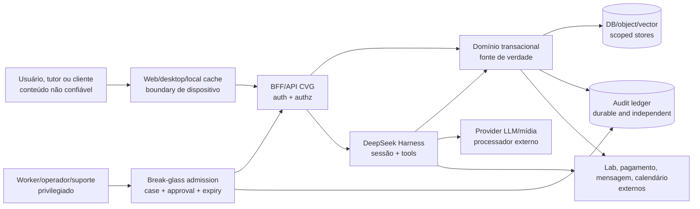

# CVG-Corp — Segurança, privacidade e segurança clínica

**Estado:** TARGET/PROPOSED; threat model de planejamento. Não é certificação, parecer jurídico, protocolo terapêutico nem prova de segurança.

## 1. Objetivo de proteção

Proteger pacientes animais, tutores, profissionais, registros clínicos, dados financeiros, credenciais, disponibilidade operacional e confiança nas decisões do Centro Veterinário Guarapiranga. O desenho assume que modelo, arquivo, e-mail, web, MCP, skill, usuário, provider e tool result podem carregar conteúdo enganoso ou malicioso.

## 2. Ativos e classificação

| Ativo | Classificação de trabalho | Impacto de exposição/alteração |
|---|---|---|
| Identidade do tutor, contatos e consentimentos | D2 pessoal | contato indevido, fraude, perda de confiança |
| Cadastro do animal e vínculos | D3 clínico/relacional | atendimento ao paciente errado, perda de histórico |
| Prontuário, exame, imagem, áudio e prescrição | D3 clínico sensível | dano clínico, exposição e decisão incorreta |
| Agenda, fila, leito e tarefas | D1/D3 operacional | perda de capacidade, atraso, tarefa omitida |
| Estoque, lote, validade e administração | D3 operacional-clínico | dispensação errada, divergência, risco à continuidade |
| Ledger, pagamento, orçamento e refund | D2 financeiro | fraude, perda financeira e divergência de cobrança |
| Prompts, sessões, memória e retrieval | D3 derivado | vazamento de contexto e inferência indevida |
| Tokens, chaves, refresh tokens e contas integradas | D4 segredo | tomada de conta e exfiltração |
| Auditoria, policy, bundle e versão de modelo | D5 controle | perda de investigação e bypass de governança |
| Backup e artefatos de restore | D2–D5 conforme conteúdo | exposição ampla e perda sistêmica |

As classes são propostas. Retenção, finalidade, consentimento, compartilhamento, residência e descarte precisam de validação formal do responsável do CVG e de privacidade.

## 3. Atores e trust boundaries



Não existe uma seta operacional direta de `OPS`, Admin Master, suporte, restore, export, worker ou plugin para `DATA`. Esses atores entram pelo BFF/admission, recebem `SecurityContextSnapshot`, passam por authz/isolamento, geram `AuditRecord` durável e só então alcançam o caso de uso ou a cópia autorizada. Restore e export são jobs controlados pelo mesmo boundary, com manifest e policy próprios; plugin in-process não ganha uma exceção por estar dentro do processo.

| Boundary | Ameaça principal | Controle obrigatório |
|---|---|---|
| Dispositivo→BFF | sessão roubada, input malformado, cache local | autenticação, sessão curta/renovável, TLS, CSRF quando aplicável, validação, proteção de dispositivo, mínimo local |
| BFF→domínio | bypass de UI, tenant spoofing, replay | contexto derivado do servidor, RBAC/ABAC, idempotência, versionamento e autorização no caso de uso |
| Harness→domínio | prompt injection, tool indevida, actor confuso | tool catalog, guard monotônico, policy, approval binding, command envelope e auditoria |
| Harness→LLM | segredo/clinical data excessivo, provider fora de policy | credential server-side, minimização, allowlist, classificação, timeout, egress e contrato de retenção |
| Harness→MCP/web/documento | conteúdo não confiável, SSRF, exfiltração | marca de untrusted content, parse/size limits, destino allowlist, sem autoridade derivada do texto |
| Worker→externo | retry duplicado, credencial ampla, webhook falso | identidade de serviço, inbox/outbox, assinatura/validação, escopo mínimo e reconciliação |
| Plugin in-process→runtime | código comprometido, skill maliciosa | supply chain, hash, revisão, allowlist; não tratar composição como sandbox |
| Operador→dados | abuso privilegiado, suporte sem necessidade | break-glass, motivo, aprovação, janela, dual control quando aplicável, auditoria e revisão |

## 4. Autorização

O servidor deve decidir `actor → action → resource → condition` com default deny. A interface pode esconder opções, mas isso não é enforcement.

| Ação | Recurso | Condições mínimas | Approval |
|---|---|---|---|
| `read` | tutor/paciente | vínculo do actor, unidade/workspace e finalidade compatíveis | não, se estritamente leitura e policy permitir |
| `read` | prontuário/exame/imagem | role clínica, atendimento/unidade atribuídos, finalidade clínica e mínimo necessário | policy; approval adicional se acesso excepcional |
| `draft` | nota/alta/mensagem/relatório | sessão autorizada, fontes permitidas, provenance e status `DRAFT` | revisão humana antes de publicar |
| `create` | agenda/tarefa | unidade, recurso e capacidade válidos; idempotency key | conforme efeito externo |
| `write` | dado operacional | role, estado atual, expectedVersion e motivo | policy/approval por risco |
| `sign` | documento clínico | profissional habilitado conforme policy do CVG, atendimento válido e revisão concluída | confirmação explícita; coassinatura se definida |
| `prescribe` | ordem de tratamento | profissional e contexto válidos, campos obrigatórios e policy clínica | approval forte; não usar agente autônomo |
| `administer` | ordem/lote | ordem verificada, paciente/medicação/lote/horário compatíveis e executor autorizado | dupla checagem conforme decisão clínica |
| `dispense` | item/lote | prescrição/ordem válida, estoque disponível, local e role | approval conforme item/policy |
| `adjust` | estoque | contagem/motivo/actor/alçada; movimento compensatório | aprovação do responsável de estoque |
| `charge` | orçamento/ledger | autorização, versão e itens válidos | conforme alçada |
| `refund` | pagamento | motivo, alçada, reconciliação e segregação | approval financeira; nunca por texto do modelo |
| `send` | mensagem/documento | destinatário verificado, consentimento, template aprovado e conteúdo revisado | obrigatório para sensível/alto impacto |
| `export` | conjunto de dados | finalidade, filtro, autoridade, prazo e formato aprovados | approval forte/break-glass |
| `delete` | dado/cache/memória | política de retenção, escopo e impacto em auditoria/backup conhecidos | autoridade explícita; nunca apagar histórico assinado silenciosamente |
| `break-glass` | qualquer recurso sensível | incidente ou finalidade autorizada, janela e reason code | segundo aprovador quando aplicável |

### Policy e revogação

A cascata proposta é `platform → organization → unit → workspace → role/actor → session`. Camadas específicas podem restringir, nunca ampliar, a policy superior. Cache ausente, corrompido, expirado ou com versão/hash divergente nega a ação governada.

O `ApprovalRequest` do motor é ligado ao `callId`, mas não carrega todos os argumentos. O CVG precisa criar um `ApprovalBinding` independente com hash dos argumentos normalizados, recurso, versão anterior, policy revision, approver, expiração, finalidade e alçada. Alteração de qualquer campo exige nova aprovação.

Revogação de usuário, role, credencial, tool, MCP, provider ou policy deve alcançar os caminhos de leitura e efeito externo. Um Agent já vivo não ganha o direito de terminar uma ação depois que a policy aplicável foi revogada; caso a consistência não possa ser confirmada, a operação falha fechado.

### Binding revogável de sessão, policy e credencial

O domínio deve emitir no servidor um snapshot curto e íntegro para cada sessão e boundary de efeito:

```text
SecurityContextSnapshot {
  authSessionId, actorId, actorKind, roleSnapshot,
  organizationId, unitId?, workspaceId?, patientId?, encounterId?,
  purpose, policyRevision, policyHash, revocationEpoch,
  credentialRef?, credentialVersion?, sessionFormatVersion?, profileDigest?,
  credentialScopeDigest, issuedAt, expiresAt, contextNonce
}

PolicyBinding {
  bindingId, sessionId, actionId, contextDigest,
  policyRevision, policyHash, actorId, resourceRef,
  credentialRef?, credentialVersion?, issuedAt, expiresAt, status
}
```

O snapshot é derivado da identidade autenticada e não pode ser preenchido pelo modelo, pelo cliente ou por texto recuperado. O BFF valida-o na abertura; o domínio revalida antes de leitura sensível e commit; o admission revalida antes de cada tool, resolução de credencial e dispatch externo. `sessionId`, `ToolExecutionToken`, nome de workspace ou `allowed-once` são referências de correlação, não autoridade.

Revogar usuário, role, workspace, policy ou credencial incrementa `revocationEpoch`, invalida caches e faz qualquer binding antigo retornar `DENIED` no próximo boundary. Um processo em andamento não adquire direito de concluir apenas porque começou antes da revogação; se não for possível observar a versão atual, fica `OUTCOME_UNKNOWN`/bloqueado. Offline só pode usar leitura D0–D2 pré-autorizada até `expiresAt` quando uma `OfflinePolicy` aprovada declarar `offlineAllowed`, `maxOfflineAge`, classes e finalidade; sem essa aprovação, nenhum `expiresAt` offline é emitido. Não há lease offline para D3–D5, privilégio ou efeito. Como uma revogação server-side não pode ser observada enquanto o dispositivo está desconectado, o contrato não promete invalidação instantânea offline: a garantia é o limite finito do lease e a revalidação obrigatória no primeiro boundary online, antes de ler ou sincronizar; falha de revalidação nega e purga o cache. Offline não pode criar binding novo nem ampliar escopo. Credenciais são referências com escopo e `credentialVersion`, resolvidas somente após o binding atual passar.

### Admin Master, suporte e break-glass

O papel `Admin Master` é uma tradução `PROPOSED` do papel de plataforma observado nas fontes; não recebe acesso clínico implícito. Até a autoridade real ser nomeada, o caminho de conteúdo sensível deve responder `DENIED`.

| Ator proposto | Pode fazer | Não pode fazer por padrão | Condições para exceção |
|---|---|---|---|
| Admin Master/plataforma | operar catálogo de providers, versões, saúde e políticas globais sem conteúdo | ler/alterar prontuário, estoque, pagamento ou sessão clínica | ticket/incidente, recursos exatos, finalidade, janela com `expiresAt`, segundo aprovador e auditoria independente |
| Admin da organização | administrar usuários, unidades, roles, workspaces e integrações da própria organização | atravessar tenant, assinar ato clínico, alterar ledger sem alçada ou ver dados de outra organização | role explícita, escopo da organização, segregação de funções e audit record |
| Suporte/operador | diagnóstico técnico minimizado e metadados redigidos | abrir sessão clínica ou baixar anexos | acesso excepcional somente por caso aprovado; sem exportação ampla; leitura just-in-time e somente dos IDs necessários |
| Investigador break-glass | consultar os recursos e eventos listados no caso | conceder role, alterar policy, apagar evidência ou executar efeito clínico/financeiro | autoridade independente, reason code, case id, lista de recursos, `startsAt`/`expiresAt`, dual control para T4 e revisão posterior |

O evento de exceção deve registrar quem pediu, quem aprovou, por quê, quais recursos/ações, policy e credencial usadas, início/fim, resultado e revisão. Break-glass não muda a role permanente, não propaga para subagentes e não pode ser reutilizado como approval de outra ação.

O formato mínimo e a regra de autoridade são:

```text
BreakGlassRequest {
  requestId, requesterId, independentApproverId,
  caseId, reasonCode, purpose, resourceRefs, actions,
  scopeDigest, policyRevision, credentialRef?, deviceId?,
  startsAt, expiresAt, decision, reviewDueAt, auditId
}
```

`requesterId` e `independentApproverId` devem ser pessoas/serviços distintos e autorizados; autoaprovação, aprovador subordinado ao requester ou autoridade não resolvida retorna `DENIED`. Para D3/D4, T3/T4, export, restore e mudança global, o segundo controle é obrigatório, não opcional. `expiresAt` é obrigatório e precisa derivar de uma política aprovada; se a duração máxima ainda for `UNKNOWN`, a solicitação não pode entrar em `ACTIVE`. A máquina é `REQUESTED → APPROVED_INDEPENDENTLY → ACTIVE → EXPIRED/REVOKED → REVIEWED`, e cada transição atravessa a admission universal, o binding revogável e o audit ledger.

## 5. Segurança clínica e IA

O agente pode organizar informação, recuperar fonte aprovada, detectar ausência, resumir, explicar e criar rascunho. Não pode autonomamente:

- fechar diagnóstico ou prognóstico;
- prescrever, alterar, suspender ou recomendar administração como decisão final;
- dispensar ou registrar administração sem ordem e controle humano apropriado;
- assinar prontuário, laudo, alta ou consentimento;
- iniciar/encerrar procedimento, internação ou alta;
- enviar orientação clínica sensível ao tutor;
- apagar, sobrescrever ou exportar histórico clínico;
- alterar orçamento, estorno ou estoque fora da alçada.

A UI e a API devem distinguir `DRAFT`, `SUGGESTION`, `APPROVED_ACTION`, `EXECUTED_RECEIPT`, `SIGNED_RECORD` e `OUTCOME_UNKNOWN`. Aceitar texto de IA não é equivalente a validar sua veracidade; a validação humana deve apontar para uma versão específica do conteúdo e das fontes.

## 6. Ameaças adversariais e controles

| ID | Cenário | Controle de desenho | Evidência futura |
|---|---|---|---|
| THR-01 | PDF ou laudo instrui o agente a ignorar policy e enviar dados. | Untrusted marker, separação de instrução/dado, tool guard e egress allowlist. | Red-team com prompt injection e teste de que policy permanece igual. |
| THR-02 | Memória de workspace de um usuário aparece no workspace de outro. | ACL em cada chunk, filtro antes do vector search, tenant/workspace no contexto e teste negativo. | known-bad cross-scope corpus. |
| THR-03 | MCP malicioso registra tool com nome parecido e obtém argumentos sensíveis. | trust level, allowlist de provider/MCP, schema, `logArguments` redigido, revisão e kill switch. | tool admission e nested-dispatch tests. |
| THR-04 | Web fetch segue redirect para metadata/private host. | transporte hardened, egress policy, block de schemes/credentials/redirects e limites de resposta. | casos DNS, IPv4/IPv6, redirect e rebinding isolados. |
| THR-05 | Approval legítimo é reutilizado com paciente/argumento diferente. | `ApprovalBinding` com digest, resource id, expectedVersion e expiração. | alterar um campo entre aprovação e execução deve negar. |
| THR-06 | Provider/worker responde timeout depois de executar o efeito. | idempotency key, receipt/query de reconciliação e `OUTCOME_UNKNOWN`; retry só quando seguro. | fault injection com resposta perdida. |
| THR-07 | Cache offline preserva privilégio revogado. | Lease finito somente para D0–D2 read-only, sem efeito; revalidação de `revocationEpoch` antes de qualquer leitura/sync online e purge em caso de negação. | revogar policy, reconectar e executar leitura/sync deve negar; D3–D5 nunca recebem lease offline. |
| THR-08 | Operador usa Admin Master para acessar prontuário sem necessidade. | break-glass, justificação, janela, aprovação, auditoria e revisão periódica. | matriz allow/deny e relatório de acesso excepcional. |
| THR-09 | Tool que ignora cancelamento mantém conexão ou altera estado após timeout. | AbortSignal, deadline externo, processo separado para efeitos longos, bounded queue. | cancelamento/timeout e recurso após quiescence. |
| THR-10 | Telemetria registra segredo ou dado clínico completo. | minimização pré-prompt, campos redigidos, sink separado, retenção e teste de known-bad. | inspeção de payload e logs de erro. |
| THR-11 | Plugin in-process comprometido ignora guard. | somente código confiável, hash/assinatura/revisão e processo separado para código não confiável. | supply-chain admission e tentativa de bypass. |
| THR-12 | Backup ou exportação replica dados sem ACL/retention. | criptografia, classificação, inventário de cópias, acesso e expurgo coordenado. | restore/export/delete ponta a ponta com dados sintéticos. |

## 7. Fluxo de dados sensíveis

```text
input do tutor/profissional
  -> BFF: validação + finalidade + escopo
  -> domínio: registro transacional mínimo
  -> contexto IA: snapshot mínimo e referenciado
  -> session log: model-visible e retenção controlada
  -> provider: somente campos autorizados e credencial server-side
  -> tool/domain: command com authz e audit
  -> telemetry: projection redigida e best-effort
  -> backup/export: política por classe e escopo
```

Antes do primeiro provider real, o CVG deve catalogar por campo: origem, finalidade, base de acesso, classificação, destinatário, região, retenção, cópia, transformação, operador e descarte. O design não presume que uma heurística de redaction detecte todo segredo ou dado clínico.

O session log é necessário para reconstruir o que o modelo viu, mas não é justificativa para enviar a conversa inteira a um provider ou conservar indefinidamente. Minimizar antes de compor o prompt; separar IDs opacos de texto identificável quando a tarefa permitir; não incluir credenciais nem instruções internas irrelevantes.

## 8. Credenciais e dispositivos

Credenciais de provider e integrações permanecem no gateway/secret store. Configuração e bundles transportam referências, não valores. Resolução ocorre por operação, com escopo mínimo, rotação, revogação e auditoria sem revelar o segredo.

Se houver desktop ou cache local, tratar o dispositivo como ambiente de risco próprio: criptografia em repouso, keychain/secure storage, atualização assinada, expiração, revogação, limpeza remota quando autorizada, cópias mínimas e nenhuma chave de provider. `danger-full-access` não é policy aceitável para o agente clínico.

### Contrato de dispositivo e cache local

O cache local permanece `PROPOSED` e deve ser opt-in por organização/unidade. O contrato mínimo é:

```text
LocalEndpointPolicy {
  deviceId, owner, allowedDataClasses, allowedPurposes,
  encryptionKeyRef, secureStorageKind, policyRevision, policyHash,
  issuedAt, expiresAt, lastSeenAt, revocationEpoch,
  offlinePolicyId?, offlineMaxAge?, updateChannel, wipeState, recoveryReference
}
```

```text
OfflinePolicy {
  offlinePolicyId, approvedBy, approvedAt, allowedDataClasses,
  allowedPurposes, maxOfflineAge, readOnly, pendingSyncAllowed,
  forbiddenActions, revocationBehavior, reviewDueAt, status
}
```

`maxOfflineAge` é obrigatório quando `readOnly` estiver habilitado; não há valor padrão permissivo. Na V1, `allowedDataClasses` de uma policy offline fica limitada a D0–D2, `readOnly=true` e `pendingSyncAllowed=false`. `pendingSyncAllowed` não autoriza commit clínico/financeiro, e qualquer ação fora de `forbiddenActions` precisa de conexão e nova admissão.

Estados: `REGISTERED → ACTIVE → EXPIRED/REVOKED → WIPE_PENDING → WIPED`; perda ou adulteração entra em `LOST` e bloqueia o endpoint. D0–D2 minimizados são o padrão; D3–D5 não recebem lease offline na V1. Depois de expirar, o cliente não lê nem sincroniza offline. Uma revogação server-side é aplicada imediatamente quando observada em boundary conectado; se o dispositivo estiver desconectado, o lease D0–D2 só pode continuar até `expiresAt`, pois a revogação não é observável localmente. Na reconexão, `revocationEpoch`/policy deve ser validado antes de qualquer leitura ou sync; divergência, estado `REVOKED` ou impossibilidade de revalidar produzem purge + `DENIED`. Wipe remove chaves antes do conteúdo, invalida tokens e registra receipt; restore só ocorre em dispositivo revalidado e com nova policy. Se o wipe remoto não puder ser confirmado, o estado fica `RECOVERY_REQUIRED` e a operação crítica permanece bloqueada. Device-loss, revoke e restore ainda são `NOT_RUN`.

Casos de aceite do endpoint: dispositivo novo sem registro → `DENIED`; keychain/secure storage ausente → `DENIED`; `policyHash`, `revocationEpoch`, versão ou `expiresAt` divergente → purge local + `DENIED`; lease expirado → nenhum read/sync; device `LOST/REVOKED` observado ou revalidado → nenhum read/sync; update sem assinatura válida → não instala; wipe confirmado → somente metadados mínimos de receipt; restore → novo `deviceId`/binding e nova aprovação. Se estiver desconectado, somente o subset D0–D2 já emitido pode ser lido até `expiresAt`; não se pode afirmar revogação imediata nesse intervalo. A policy de offline não pode ser inferida da existência do app e não pode emitir privilégio após desconexão.

### Buffer de composição durante desconexão

Este é o contrato canônico de preservação e exibição do texto não enviado na V1. Preservar bytes em memória não autoriza leitura offline nem altera a classificação. A classificação efetiva considera o conteúdo e a classificação mínima do contexto de origem: um composer clínico é no mínimo D3. Conteúdo misto usa a classificação mais restritiva; classificação ausente, desconhecida ou não validada nunca é presumida D0–D2. Texto do usuário/modelo não pode rebaixar essa classificação.

| Buffer existente antes da queda | Preservação temporária | Exibição offline |
|---|---|---|
| D0–D2 com classificação validada e autorização offline vigente para classe/finalidade | somente em memória enquanto o contexto original for válido | somente leitura; edição e envio bloqueados |
| D3–D5, classificação desconhecida ou leitura offline não autorizada | somente em memória, em quarentena, enquanto o contexto original for válido | conteúdo oculto; mostrar apenas aviso de indisponibilidade |

A quarentena é uma exceção restrita de preservação do buffer já existente, não um lease de leitura D3–D5, cache clínico ou permissão para capturar conteúdo novo offline. O conteúdo oculto sai do DOM renderizado e da árvore de acessibilidade e não fica disponível por seleção, cópia, preview ou exportação da aplicação. Não persistir o buffer em storage local, session log, auditoria, telemetry ou fila de sincronização, nem enviá-lo ao provider. Esta regra de interface não substitui os controles de dispositivo e memória.

`COMPOSER_CONTEXT_LOST` purga tanto o buffer visível quanto o buffer em quarentena. Valem os limites temporais do contexto/sessão original e do lease, quando houver; desconectar não renova prazo nem cria lease para D3–D5. Na reconexão, antes de exibir conteúdo oculto, revalidar identidade, sessão, recurso/contexto de origem, finalidade, classificação e policy atuais. Classificação desconhecida permanece oculta até classificação autorizada; falha de revalidação invalida o contexto e purga o buffer. Revalidação bem-sucedida permite revisão e envio explícito, nunca envio automático.

Aceite obrigatório: texto clínico não enviado (D3) → desconexão → buffer preservado apenas em memória e oculto em todas as superfícies da aplicação → reconexão autorizada → revisão/envio explícito; repetir com conteúdo desconhecido, D0–D2 autorizado, ausência de lease, expiração e revogação. Expiração/falha de revalidação deve purgar; classificação desconhecida não pode liberar exibição por fallback. Os testes continuam `NOT_RUN`.

## 9. Auditoria

Auditoria crítica deve ser um ledger durável e independente de telemetria. Cada registro inclui, quando aplicável:

```text
auditId, occurredAt, actorId, actorKind, organizationId, unitId, workspaceId,
resourceType, resourceId, action, purpose, stateBefore, stateAfter,
policyRevision, model/provider/version, tool/version, argumentDigest,
approvalId, commandId, sessionId, correlationId, outcome, reasonCode
```

Não colocar segredo, token, prompt integral ou payload clínico desnecessário no evento. O ledger precisa ser consultável somente por roles de auditoria e ter sua própria trilha de acesso. Telemetria `FULL`, `FEEDBACK_ONLY` ou `DISABLED` do motor não muda essa obrigação.

### Contrato de telemetria e perda

Telemetria é uma projeção operacional, não o ledger de auditoria. Antes de habilitá-la, o CVG deve publicar uma `TelemetryPolicy` versionada com `allowedFields`, versão de redaction, classificação máxima, tamanho máximo, sampling, retenção, destino, owner, comportamento de perda e chave de deduplicação. Sem policy ou com collector não confiável, reduzir/desligar a projeção e manter a operação clínica sem depender dela.

Cada evento possui `telemetryEventId`, `correlationId`, `auditId?` e timestamp; duplicatas são identificáveis e a perda é medida por sequence/flush lag. Uma queda do collector pode gerar `TELEMETRY_DEGRADED`, mas nunca remove, retarda ou substitui o `AuditRecord` durável. Payloads conhecidos-bons e conhecidos-ruins devem provar que redaction não deixa segredo/PII clínico desnecessário e que a retenção/expurgo seguem a `TelemetryPolicy`. Implementação e teste permanecem `NOT_RUN`.

## 10. Privacidade e autoridade

O corpus não informa política de retenção, consentimentos, contratos com providers, uso para treinamento, residência de dados, exportação ou eliminação. Esses pontos ficam `UNKNOWN` até decisão humana. A equipe não deve apresentar “LGPD compliant”, “seguro” ou “confidencial” como fato antes de obter base, controles e evidência correspondentes.

Decisões que exigem autoridade: acesso privilegiado a dados clínicos; escolha de provider/região; coleta de áudio/imagem; retenção e descarte; compartilhamento com laboratório/pagamento/mensageria; operação offline; aprovação de ação clínica e aceitação de risco residual alto.

## 11. Verificação de segurança

Antes do piloto, executar em ambiente isolado e com dados sintéticos:

1. matriz positiva/negativa por role, tenant, unidade, workspace, paciente e estado;
2. cross-scope em DB, object store, vector store, cache, sessão, export e backup;
3. prompt injection em documento, memória, e-mail, web, MCP, tool result e Code Mode;
4. alteração de argumentos/paciente/policy entre approval e dispatch;
5. credencial ausente, revogada, expirada e erro de redaction;
6. SSRF, redirect, DNS/rebinding, payload oversized e egress proibido;
7. timeout, cancelamento, retry, duplicidade, crash e `OUTCOME_UNKNOWN`;
8. restore, retenção, exclusão lógica, expurgo e auditoria de acesso excepcional;
9. plugin/bundle sem hash, origem não confiável e kill switch;
10. known-good que deve passar e known-bad que deve falhar para cada gate crítico.

O estado atual de todos esses testes é `NOT_RUN`.

## 12. Matriz de isolamento por store

O isolamento precisa ser aplicado no ponto de leitura, escrita, exportação e restauração. Prefixo, nome de workspace, filtro de UI ou `ctx.tools.restrict()` sem uma decisão server-side não contam como enforcement.

| Store/fluxo | Chave mínima de escopo | Enforcement proposto | Negative test obrigatório | Owner/estado |
|---|---|---|---|---|
| DB transacional | organization + unit/workspace quando aplicável + actor/purpose | repositório/caso de uso, constraint, row policy e transação | actor de A tenta buscar/editar B por ID e por busca; resposta indistinguível de inexistente | domínio/dados — `PROPOSED/NOT_RUN` |
| Object store | DataRef + resource ACL + organization | autorização antes de URL curta; key/prefix apenas roteamento | URL/ID de anexo de B, versão antiga e export cancelado | dados/privacidade — `PROPOSED/NOT_RUN` |
| Vector index | organization/unit/workspace + ACL + KnowledgeVersion | filtro obrigatório antes da busca e validação do resultado | chunk de B com termos idênticos retorna zero para A, inclusive por query híbrida | conhecimento/privacidade — `PROPOSED/NOT_RUN` |
| Session/persistence DSH | session owner + SecurityContextSnapshot + scope digest | gateway resolve sessão e recusa replay/flush fora do binding | usuário A fornece `sessionId` de B ou troca workspace antes de tool | AI gateway — `PROPOSED/NOT_RUN` |
| Cache/device | deviceId + policyHash + revocationEpoch + DataRef | chave de dispositivo, TTL, criptografia e revalidação online | cache quente com role revogada, workspace trocado ou device marcado perdido | segurança/ops — `PROPOSED/NOT_RUN` |
| Billing/ledger | organization + unit financeira + resource scope | caso de uso financeiro e ledger append-only | webhook/ID de B submetido por A, inclusive export/reconcile | financeiro — `PROPOSED/NOT_RUN` |
| Export | manifest de recursos + finalidade + aprovação + expiração | job monta somente recursos autorizados e cifra o artifact | pedido com um ID autorizado e um ID de B não produz export parcial nem vazamento | privacidade/dados — `PROPOSED/NOT_RUN` |
| Backup/restore | tenant/key/manifest/schema/ACL | chaves separadas, restore isolado, scan de escopo antes de liberar | backup de B restaurado no ambiente de A, mixed tenant ou ACL ausente | dados/ops — `PROPOSED/NOT_RUN` |
| Provider/telemetry | transfer policy + minimização + tenant pseudonymizado | gateway/TelemetryPolicy; sem payload clínico por padrão | conteúdo de B ou segredo aparece em request/log/erro de A | AI gateway/ops — `PROPOSED/NOT_RUN` |

O row combinado de provider/telemetry acima não é suficiente como contrato de controle; os três boundaries abaixo são os owners normativos para a execução:

| Boundary separado | Chave mínima | Enforcement e falha | Negative test | Owner/estado |
|---|---|---|---|---|
| Audit ledger | organization + resource scope + audit authority | `AuditWrite` durável antes do efeito; leitura com role de auditoria e trilha própria; falha do sink bloqueia o efeito | operador sem escopo tenta ler/forjar evento e uma operação T3 ocorre com audit store indisponível | segurança/ops — `PROPOSED/NOT_RUN` |
| Provider | transfer policy + minimização + tenant pseudonimizado | gateway, credential scope, egress e `ProviderTransferPolicy` antes do request | conteúdo de B/segredo ou provider fora da região/policy chega ao request | AI gateway/privacidade — `PROPOSED/NOT_RUN` |
| Telemetry | tenant pseudonimizado + correlation, sem recurso clínico integral | `TelemetryPolicy`, redaction, dedup e perda medida; nunca authz nem auditoria | segredo/PII aparece no log, collector duplicado é tratado como projeção duplicada sem efeito de negócio | ops/segurança — `PROPOSED/NOT_RUN` |

Todos os testes devem cobrir leitura, mutação, erro, retry, export, backup e recuperação. Um teste positivo de A não compensa a ausência do negativo de B; `ISO-01` só será `PASS` após a matriz executável ser aprovada e rodada no artifact exato.

## 13. Admission universal e escrita de auditoria

O mesmo boundary normativo atende usuário, tutor, Admin Master, suporte, worker, restore, export, tool, MCP, skill e plugin. A forma física pode ser um processo, pacote ou job diferente; a sequência de controle não pode ser omitida:

```text
caller
  -> resolve authenticated identity + SecurityContextSnapshot
  -> ReplayLookupAdmission (decode, scope, revocation, current read authz)
  -> stable idempotency lookup
  -> [compatible record] -> AuditIntent/read -> receipt/result
  -> [no record] -> NewExecutionAdmission (action/state authz, policy, registry)
  -> budget + approval + credential + egress for a new execution
  -> AuditIntent durável -> domain use case or scoped copy operation
  -> receipt / outcome -> AuditOutcome durável + redacted telemetry
```

`AuditIntent` e `AuditOutcome` são propostas de D5 e não dependem do collector de telemetry:

```text
AuditWrite {
  auditId, phase: INTENT|OUTCOME,
  actorId, actorKind, organizationId, unitId?, workspaceId?,
  action, resourceType, resourceId, purpose,
  contextDigest, policyRevision, policyHash,
  approvalBindingId?, budgetReservationId?, commandId?,
  idempotencyKey?, externalRequestId?, outcome, reasonCode,
  occurredAt, previousAuditHash?
}
```

O diagrama separa deliberadamente dois caminhos. `ReplayLookupAdmission` revalida a identidade, o escopo, a revogação e a autorização atual para ler o registro/resultado; busca pela chave estável e, se encontrar digest compatível, devolve o receipt/resultado original sem registry de execução, budget, approval, credencial, egress ou dispatch. Se o registro estiver em `ADMISSION_PENDING`, devolve `ADMISSION_IN_PROGRESS` até o lease expirar e o reconciliador finalizar ou recuperar o claim; não promove o registro por conta própria. Se não encontrar, transfere para `NewExecutionAdmission`, que faz a autorização da ação/estado e a admissão completa antes de reivindicar a operação e executar. Uma chave existente com digest divergente é conflito, não uma nova execução.

Para efeito interno, `AuditIntent + domain commit + AuditOutcome` usa a mesma transação ou um outbox durável com regra de não-liberação até os dois estados serem reconciliados. Para efeito externo, o `AuditIntent` precisa estar durável antes do dispatch; o adapter grava receipt/outcome ou `OUTCOME_UNKNOWN`, sempre com a mesma idempotency key. Falha ao escrever o audit ledger bloqueia T2–T4, export, restore e break-glass; não há fallback para apenas log ou telemetry. Leitura de auditoria gera sua própria trilha; a leitura de um receipt também conserva a correlação com `originalActionId`/`originalCommandId`.

Workers e plugins nunca recebem conexão direta a store clínico, ledger ou audit store. Eles podem solicitar uma porta, e a porta reexecuta a admissão com o `SecurityContextSnapshot` atual. O lookup de idempotência pela `IdempotencyLookupKey` estável ocorre antes de consumir approval; somente uma nova execução segue para budget, approval, credencial e egress. Código in-process é confiável por processo, mas não é dispensado desta regra; código não confiável é `DENIED` até obter processo/boundary real e testes de bypass. Implementação, teste de crash e teste de sink indisponível permanecem `NOT_RUN`.

## 14. Proposta de autenticação para M1 sintético

**Estado:** aprovada para M1 local em DEC-M1-04/05; autenticação implementada em B3, com evidências e limites no checkpoint de 07, limitada ao ambiente local e às contas sintéticas. Não define política de credenciais ou retenção de produção.

- Login por identificador local e senha; sem autoinscrição, e-mail, recuperação remota ou provedor externo. Bootstrap recebe senhas por prompt oculto, sem argumentos CLI ou logs; contas de teste usam segredos efêmeros gerados pelo teste.
- Hash de senha com `crypto.scrypt` assíncrono: salt aleatório de 16 bytes por senha, `N=131072`, `r=8`, `p=1`, saída de 64 bytes e `maxmem=256 MiB`; guardar algoritmo/parâmetros junto ao hash. Comparação de buffers de mesmo tamanho em tempo constante. Medir consumo no scaffold; no máximo duas derivações simultâneas e fila limitada. A API oficial documenta scrypt, aleatoriedade e comparação em [Node 24 crypto](https://nodejs.org/docs/latest-v24.x/api/crypto.html); os parâmetros são proposta deste projeto.
- Sessão server-side PostgreSQL com identificador aleatório de 32 bytes, regenerado após login. Não guardar senha, papéis autoritativos ou token de sessão no armazenamento web. Store indexa hash do identificador, registra usuário, criação, último uso, expiração e revogação; segredo de assinatura fica fora do banco e do repositório.
- Expiração proposta: 30 minutos sem atividade e máximo absoluto de 8 horas; renovação não ultrapassa o limite absoluto. Logout revoga no servidor e limpa o cookie. Toda requisição protegida valida sessão e vínculos atuais.
- Cookie `HttpOnly`, `SameSite=Strict`, `Path=/`, sem `Domain`; `Secure` em HTTPS. A exceção HTTP é exclusiva de execução sintética em `127.0.0.1`, explicitamente configurada. Host/origem permitidos são exatos; aplicação recusa exposição fora do loopback nessa configuração.
- Escritas exigem JSON, origem autorizada e token CSRF vinculado à sessão. Login também valida origem e tipo de conteúdo. Sem CORS amplo. Respostas autenticadas usam `Cache-Control: no-store`.
- Login: resposta uniforme para usuário inexistente/senha incorreta, inclusive derivação equivalente com hash fictício; limite inicial de 5 tentativas por identificador em 15 minutos e 30 por IP, contador server-side, `429` e `Retry-After`; não confiar em IP encaminhado por cliente. Ajustar apenas com evidência no teste local.
- Não habilitar promoção/revogação de administrador, recuperação de conta, impersonação ou break-glass. Administrador só concede/revoga `veterinario` e `recepcao` no próprio escopo, sem alterar o próprio vínculo. Operador técnico nasce apenas no bootstrap e não ganha acesso administrativo por esse papel.
- Auditoria sintética permanece durante o ciclo de desenvolvimento, sem purge automático nem API de exclusão. Descarte completo do ambiente é operação explícita separada; backups não podem ficar em Git. Isso não decide retenção de dados reais.

A matriz inicial foi confirmada em DEC-M1-05; sua implementação administrativa permanece em B4. Leitura de auditoria também é auditada; falha desse registro retorna indisponibilidade sem liberar dados. Uma negação continua negada se o sink falhar: retornar erro genérico de indisponibilidade, emitir sinal técnico redigido e nunca converter falha em permissão ou alegar auditoria durável.
