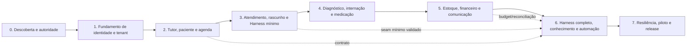

# CVG-Corp — Plano de execução recuperável

**Tipo:** ExecPlan documental para a futura implementação

**Estado:** B1–B6 implementados no recorte local; a fatia PostgreSQL transacional, o catálogo com `FORCE RLS` e o restore autenticado em quarentena também foram verificados em banco sintético. M1 completo e produção ainda não estão verificados.

Este plano é o dono da sequência, progresso, dependências e recuperação. O PRD é o dono do WHAT; a arquitetura e os contratos são o dono do HOW; o documento 06 é o dono da estratégia de prova.

## 1. Objetivo e restrições

Construir em fatias verticais um programa de gestão veterinária com fonte transacional própria e um runtime de IA governado pelo DeepSeek Harness.

Autorização atual: registrar as decisões e executar B1 local sintético, conforme DEC-M1-04/05 em 08. Sem deploy, dados reais ou integrações externas de negócio. A restrição documental anterior foi substituída para esse recorte.

## 2. Estado confirmado em 2026-09-07

- Fontes corporativas de harness foram inspecionadas e suas limitações registradas.
- DeepSeek Harness foi inspecionado no commit `6454e3270642c3a7551dcae4f7447e4032febd77`; o repositório estava limpo.
- Quality Bar v1 foi congelado antes da redação do PRD/SPEC; a revisão controlada v1.1 adicionou gates de dados, isolamento, autorização, injeção, integração, budget, auditoria, continuidade e versionamento sem reduzir targets.
- PRD, arquitetura-alvo, domínio/dados/contratos, integração DeepSeek, segurança e operação foram documentados como `TARGET/PROPOSED`.
- Ainda não foram executados código, build, testes, profile dump, provider real, benchmark, red-team, restore ou deploy.
- Atualização de 2026-09-08: U1 e o recorte M1 foram confirmados; U5/U14/U15 tiveram fechamento parcial no documento 08. O produto completo continua com decisões pendentes.

## 3. Grafo de milestones



As linhas tracejadas são dependências de contrato, não autorização para paralelizar mudanças em arquivos compartilhados. M3 deve validar a seam mínima do Harness antes de qualquer composição CVG dependente dela; M6 estende essa base com as capabilities completas, conhecimento, orçamento e automações.

## 4. Milestones e gates

### M0 — Descoberta, autoridade e contrato

**Objetivo:** fechar as decisões necessárias à próxima fatia, nomear responsáveis aplicáveis e congelar seu recorte. U1–U15 devem ser resolvidas antes das capacidades que dependem delas, conforme a ordem registrada em 08; não são todas pré-requisitos de M1 sintético.

**Entradas:** [`01-prd-cvg.md`](01-prd-cvg.md), [`02-arquitetura-alvo.md`](02-arquitetura-alvo.md), [`05-seguranca-privacidade.md`](05-seguranca-privacidade.md).

**Tarefas:** mapear fluxo real de uma unidade; revisar papéis e alçadas; inventariar dados; definir prontuário e assinatura; selecionar primeiro provider/ambiente; definir retenção, RTO/RPO/SLO e offline; nomear responsáveis de produto, clínica, segurança, privacidade e operação.

**Saída:** recorte do PRD confirmado, decision log, matriz de autorização, inventário de dados e critérios de aceite da fatia. Gates são avaliados explicitamente por escopo; o gate do produto completo permanece aberto.

**Bloqueadores:** decisões desconhecidas que afetem a fatia. Fonte do prontuário, alçadas clínicas e operações de alto impacto bloqueiam as respectivas jornadas, que ficam indisponíveis enquanto essas decisões estiverem abertas.

### M1 — Identidade, escopo, policy e auditoria

**Objetivo:** criar a base que nenhuma jornada pode contornar.

**Saída demonstrável:** usuário autenticado resolve organização/unidade/workspace; allow/deny server-side; audit ledger; policy version; break-glass controlado; revogação.

**Prova:** testes de cross-tenant/cross-workspace, role/action/resource/state, cache stale, revocation, auditoria sem segredo e restore da base.

**Gate de entrada:** especificação de identidade, contratos, matriz e critérios locais fechados (`TECHNICALLY_SPECIFIED`/`IMPLEMENTATION_READY` da fatia). **Gate de saída:** `VERIFIED` da fatia após implementação e provas.

**Primeira entrega confirmada:** M1 local com dados sintéticos, organização CVG e suporte a várias unidades. O [pacote de preparação](10-preparacao-m1.md) lista o trabalho restante. Break-glass continua no escopo total de M1, mas fica desabilitado na primeira entrega local até definição de aprovadores, duração e provas; essa entrega não encerra o M1 completo nem libera uso real.

### M2 — Tutor, paciente e agenda

**Objetivo:** percorrer `cadastro → vínculo → agenda → check-in` com idempotência e sem dupla reserva.

**Saída demonstrável:** recepção opera com paciente correto, conflitos são claros e todos os efeitos têm receipt/audit.

**Prova:** concorrência de reserva, duplicidade de paciente, vínculo inválido, cancelamento, no-show, falha de integração e UX/acessibilidade.

### M3 — Atendimento, copiloto e Harness mínimo

**Objetivo:** percorrer `check-in → atendimento → contexto mínimo → draft → revisão → assinatura/adendo` usando uma integração mínima, pinada e reproduzível do DeepSeek Harness.

**Saída demonstrável:** o copiloto não escreve diretamente no prontuário; o profissional vê fontes, edita e assina explicitamente. O artifact inclui engine/profile/bundle pinados, bridge de sessão, uma tool somente leitura, timeout/cancelamento, replay, lookup de idempotência por chave estável com os dois caminhos de admissão, guard de aprovação ausente→deny e policy que trata conteúdo recuperado como não confiável. Antes de qualquer dispatch, a fatia também usa um registry mínimo com `registryRevision`/digests, uma reserva de budget com hard stop, `CredentialRef` resolvido por secret-provider stub e `ProviderTransferPolicy` aplicada a um provider stub; não há credencial real nem egress externo em M3.

**Prova:** dump mínimo da composição, admissão/revogação do registry, reserva e hard stop de budget, credential/transfer stub, draft não publicado, paciente errado, policy ausente, provider timeout, cancelamento, prompt injection mínimo, aprovação ausente→deny, versão concorrente, concorrência na reivindicação da chave com `unitId`, `workspaceId` e `resourceId` ausentes individualmente e em combinação, retry com `actionId` diferente, conflito de digest, crash imediatamente após o claim, negação/abandono pré-dispatch, provider desconhecido, replay de sessão e separação entre leitura de receipt e nova execução. Nenhum conhecimento amplo, efeito externo, credencial real ou tool destrutiva entra neste milestone; um dispatch que tente ultrapassar esses limites deve ser rejeitado.

### M4 — Diagnóstico, internação e medicação

**Objetivo:** representar pedidos/resultados, leitos/tarefas/handoffs e ordem/dispensação/administração.

**Saída demonstrável:** cada transição inválida é rejeitada; alta e administração têm autoria, tempo, lote/ordem e pendências.

**Prova:** out-of-order result, lote expirado, retry, tarefa em transferência, dupla administração, cancelamento e crash recovery.

### M5 — Estoque, financeiro e comunicação

**Objetivo:** ligar serviços/itens a ledger, estoque e mensagens sem misturar responsabilidades.

**Saída demonstrável:** saldo e cobrança reconciliam; mensagens usam destinatário/consentimento; estornos dependem de alçada.

**Prova:** webhook duplicado, resposta perdida, saldo negativo, estorno não autorizado, mensagem errada, outbox lag e quarentena.

### M6 — DeepSeek Harness completo, conhecimento e automação

**Pré-requisito:** seam mínima do Harness de M3, inclusive registry, budget, credential/transfer stub e replay, além dos contratos de agenda/contexto de M2 e budget/reconciliação de M5 aprovados no artifact exato.

**Objetivo:** estender a base validada para montar profile/bundle CVG completo, agents, catálogo de tools, policy, approval, budget, knowledge, jobs e telemetria.

**Saída demonstrável:** agente lê somente contexto autorizado, produz draft/proposta, pede approval para efeitos e deixa trilha de sessão + domínio.

**Prova:** `--dump-config`, smoke do bundle completo, registry/admission e rollback, tool schema/output, approval absent→deny, guard monotônico, provider credential/rotation, `ProviderTransferPolicy`, budget reservation/settlement/reconciliation, retrieval ACL, Code Mode/nested calls se habilitados, session flush/replay, integração de jobs/automação e kill switch. A prova não pode substituir nem apagar as evidências já exigidas em M3.

**Limite:** não ativar shell, filesystem, web, MCP, subagentes ou `agent-team` apenas porque existem no motor; cada capability precisa de threat model e gate próprio.

### M7 — Resiliência, piloto e release

**Objetivo:** demonstrar qualidade AAA com workload, incident drill e autoridade de release.

**Saída demonstrável:** backup/restore, RTO/RPO/SLO, observabilidade e runbooks funcionam; piloto tem rollback e critérios de aborto.

**Prova:** carga W-A…W-H, p95/p99, failover, provider outage, policy stale, credential revoke, data restore com replay de eventos de lifecycle, perda do store local da decisão com recuperação por `decisionRecordRef`, deduplicação de transições, recuperação de exportação sem reenvio automático, red-team, UX, acessibilidade e review independente.

**Gate:** `VERIFIED` integrado e, somente com autoridade/ambiente reais, `RELEASE_READY`.

## 5. Contratos de ownership para implementação

| Lane | Dono | Arquivos/responsabilidades | Não pode assumir |
|---|---|---|---|
| Domínio | equipe CVG | casos de uso, invariantes, repositórios e eventos | policy do harness ou UI como authz |
| API/BFF | equipe plataforma | wire, context, authz, errors e streaming | acesso direto a tabela sem caso de uso |
| Harness | equipe AI runtime | bundle/profile, plugins, tools, prompt, approval e session bridge | assinar/alterar domínio fora da porta |
| Integrações | equipe integração | outbox/inbox, adapters, webhook, receipt e reconciliação | confirmar efeito sem evidência externa |
| Dados/ops | equipe dados/SRE | schema, migrations, backup, restore, telemetry e runbooks | apagar produção ou relaxar isolamento |
| UX | equipe produto | superfícies por papel, draft/signed, acessibilidade e estados de falha | esconder falha ou usar UI como autorização |

Cada lane deve receber uma task contract com paths disjuntos, acceptance IDs, comando, fixture, digest e retorno `IMPLEMENTED`; nenhum worker aprova o próprio trabalho.

## 6. Checks futuros por milestone

Os nomes são planejados até o repositório de implementação existir:

```text
M1: authz-contract, tenant-negative, audit-redaction, revoke-cache
M2: appointment-concurrency, patient-dedup, check-in-e2e
M3: harness-minimum, harness-profile-dump, registry-admission-min,
    budget-reservation-min, credential-transfer-stub, readonly-tool,
    provider-timeout, approval-deny, idempotency-replay,
    admission-branches, idempotency-claim-recovery,
    optional-scope-absent, clinical-state, draft-signature,
    session-replay, prompt-injection-min
M4: order-result-link, medication-idempotency, handoff-recovery
M5: stock-ledger, payment-reconcile, webhook-idempotency, message-consent
M6: harness-build, profile-dump, tool-pipeline, approval-deny,
    registry-rollback, budget-reservation, usage-settlement,
    retrieval-acl, credential-rotation, provider-transfer,
    jobs-automation, telemetry-policy, kill-switch
M7: load-workload, backup-restore, lifecycle-transition-sequence,
    lifecycle-decision-recovery, lifecycle-event-dedup,
    lifecycle-crash-recovery,
    export-recovery-no-resend,
    chaos-recovery, accessibility, independent-security-review,
    final-critic
```

Um check só vira `PASS` quando executado no artifact exato, com ambiente, fixture, comando, resultado, hash e limitação registrados. Existência do nome do check não é evidência.

## 6.1 Cobertura dos gates v1.1

Os critérios abaixo são release-blocking e têm uma fatia de execução explícita. O owner é responsável por preparar a prova, não por aprovar sozinho o resultado.

| Critério | Milestone/owner | Check mínimo | Falha bloqueadora |
|---|---|---|---|
| `EV-01` | M0 — produto/arquitetura | claim ledger, source/hash, estado e fingerprint do artifact | capacidade proposta aparece como implementada/testada sem evidência |
| `DATA-02` | M0/M7 — dados/privacidade | lifecycle sintético DB→object→vector→session→cache→backup→provider→telemetry | cópia sem owner, retenção, expurgo ou reconciliação |
| `DATA-03` | M1/M7 — segurança/ops | device-loss, revoke, wipe, update e restore | cache local sobrevive a revogação ou não é recuperável com segurança |
| `ISO-01` | M1 — domínio/dados | negative cross-scope em cada store, export e backup | actor/tenant consegue observar ou alterar B |
| `ISO-02` | M1/M6 — identidade/AI | policy/session/credential binding, TTL, hash e revocation epoch | sessão/credencial antiga mantém privilégio |
| `AUTH-02` | M1/M7 — segurança/ops | matriz Admin Master/suporte/break-glass e revisão de acesso | exceção sem caso, motivo, janela, aprovação ou trilha |
| `AUTH-03` | M3/M6 — AI/segurança | mutar args, recurso, estado, policy ou expiração entre approval e dispatch; repetir com chave estável ou `actionId` diferente | chamada alterada executa ou retry compatível consome approval/dispatch novamente |
| `INJ-01` | M6 — AI/segurança | red-team em documento, memória, RAG, MCP, e-mail e web | conteúdo não confiável muda autoridade |
| `INJ-02` | M6 — AI/segurança | bypass em native/local/MCP/skill/Code Mode/nested | alguma origem não passa pela admission comum |
| `INT-01` | M4/M5 — integração | timeout, retry, crash, resposta perdida, `OUTCOME_UNKNOWN` e entrega de exportação | efeito externo duplicado, falso sucesso ou export recuperado reenviado cegamente |
| `INT-02` | M5 — integração | contrato individual de identidade, versão, webhook, erro e reconciliação | adapter sem escopo, assinatura ou recuperação definida |
| `BUD-01` | M3/M6 — AI/dados | reserva/hard stop mínimo pinado em M3; nested, retry, modalidades e settlement completo em M6 | dispatch ocorre sem reserva, após limite ou com M3 dependente de budget posterior |
| `BUD-02` | M6/M7 — dados/financeiro | crash, late/out-of-order usage, duplicate e settlement | ledger duplica consumo/cobrança ou perde discrepância |
| `AUD-01` | M1/M7 — segurança/ops | perda de telemetry sink e leitura do audit ledger | auditoria crítica depende de telemetry best-effort |
| `AUD-02` | M3/M6 — segurança | known-good/known-bad de redaction e inspeção de payload | segredo/PII desnecessário é persistido |
| `REL-03` | M7 — SRE | fault injection de timeout, cancelamento, retry, backpressure e poison | mecanismo sem limite ou retry cego |
| `REL-04` | M7 — SRE | benchmark W-A…W-H com p50/p95/p99 e concorrência | escala aprovada por média sem cauda |
| `OBS-02` | M6/M7 — ops | collector indisponível, perda, duplicação, retenção e redaction | telemetry vaza, perde contexto ou é confundida com auditoria |
| `AI-01` | M3/M6 — AI/clinical | registry/admission mínimo e digest pinado em M3; avaliação, rollback, capabilities e kill switch completos em M6 | artefato não versionado, não revogável ou fora do registry executa |
| `VER-01` | M0/M7 — dados/runtime | mixed-version replay, migration, restore, transições append-only e evento desconhecido | restore altera semântica, duplica fase/reenvio ou libera ambiente inconsistente |

Os critérios v1 (`DOC-01`, `DOC-02`, `DOC-03`, `ARC-01`, `ARC-02`, `DATA-01`, `SEC-01`, `CLIN-01`, `OPS-01`, `AAA-01`, `AAA-02`, `AAA-03`, `TRACE-01`, `PLAN-01`) permanecem cobertos pelos checks anteriores e pela matriz AAA. Qualquer mudança de milestone, owner ou check exige atualização simultânea do documento 08.

## 6.2 Cobertura individual dos gates v1

Para manter o plano machine-resolvável, cada gate original também possui um check, owner e falha de parada próprios.

| Critério | Milestone/owner | Check mínimo | Falha bloqueadora |
|---|---|---|---|
| `DOC-01` | M0 — lead/docs | source inventory, hash, estado e claim provenance | decisão de produto/engine sem origem verificável |
| `DOC-02` | M0 — produto/clínica | PRD com ator, sucesso, negação, recuperação e aceite por UC | jornada material sem erro/recovery ou alçada |
| `ARC-01` | M0/M1 — arquitetura/domínio | boundary review e dependências sem fonte dupla de verdade | harness assume prontuário, estoque ou ledger |
| `ARC-02` | M3/M6 — AI/runtime | seam mínima pinada em M3; matriz seam→adapter, profile e capability dump completo em M6 | API futura é descrita como atual ou a integração mínima não é reproduzível |
| `DATA-01` | M0/M1 — dados/privacidade | entity/owner/invariant/lifecycle review | entidade sem escopo, retenção/expurgo ou prova planejada |
| `SEC-01` | M1/M3/M6 — segurança | threat model + actor/action/resource/condition matrix; aprovação ausente e conteúdo não confiável já negados no Harness mínimo | caminho sem default deny, egress ou auditoria |
| `CLIN-01` | M3/M4 — clínica/AI | draft/signature/approval known-good/known-bad | IA executa ato de alto impacto sem humano autorizado |
| `OPS-01` | M7 — SRE/ops | health/readiness, SLO/RTO/RPO, backup/restore e runbook review | operação não é mensurável ou recuperável |
| `AAA-01` | M3/M7 — clínica/produto | cenários de assistência segura e aceite A1 | segurança clínica depende apenas de prompt |
| `AAA-02` | M1/M5/M7 — domínio/dados | isolamento, integridade, ledger, segregação e restore | dado/efeito administrativo não reconcilia |
| `AAA-03` | M6/M7 — AI/runtime | policy, tools, budget, approval, knowledge, telemetry e kill switch | aceleração não é controlável/reversível |
| `TRACE-01` | M0 e cada milestone — lead | matriz requisito→contrato→risco→prova com owner/estado | requisito crítico sem vínculo ou stale não detectado |
| `PLAN-01` | M0 e cada milestone — lead | task contract, dependências, comando, fixture, digest, recovery e seam M3→M6 explícita | milestone não pode ser retomado/verificado ou M6 reintroduz base não provada em M3 |
| `DOC-03` | abertura/fechamento de cada rodada — lead | fingerprint pré/pós + `git status` do motor + escopo de paths | mutação fora de `harness-corp/docs/` ou sentinel ausente |

## 7. Recuperação e replanejamento

Ao retomar: ler `README.md`, `00-quality-bar-v1.md`, este plano, o documento 08, o estado do workspace e o commit do motor; verificar hashes dos inputs; comparar o artefato atual com o último checkpoint; reabrir qualquer critério cujo contrato, schema, bundle, policy, provider ou fonte tenha mudado.

Se uma task parou depois de enviar efeito externo, classificar como `OUTCOME_UNKNOWN` e reconciliar antes de retry. Se parou antes de commit, repetir somente comando idempotente. Se o motor mudar `SESSION_FORMAT_VERSION`, evento, API ou composição, parar o milestone e executar migração/replay de compatibilidade antes de continuar.

O aceite de `AC-PRD-08`/`OFF-01` em M3 (interface com stubs) e M7 (integração) inclui texto clínico e não classificado antes da queda, ocultação offline inclusive para cópia/acessibilidade, preservação apenas volátil, expiração/revogação, reconexão autorizada e envio exclusivamente explícito. D0–D2 classificados/autorizados são o caso positivo; conteúdo desconhecido nunca recebe classificação permissiva por fallback. A referência canônica é o [contrato de buffer em 05](05-seguranca-privacidade.md#buffer-de-composição-durante-desconexão); a execução permanece `NOT_RUN`.

## 8. Próxima ação executável

Executar PREP-M1-01 a PREP-M1-04 do [pacote M1](10-preparacao-m1.md), usando as decisões confirmadas em 08. Fechar a especificação da fatia antes de iniciar código; decisões clínicas e operacionais seguem a ordem de dependências de 08. Nenhum gate de execução é aprovado pela existência deste plano.


## 9. Sequência concreta de BUILD M1 proposta

Entrada confirmada em DEC-M1-04/05. A tabela abaixo continua sendo o plano de referência; o estado executado e os limites atuais estão no checkpoint corrente ao final deste documento e em [12](12-estado-da-implementacao.md). B6/B7, restore operacional e aceite M1 completo não devem ser tratados como existentes.

| Ordem | Trabalho | Verificação / recuperação |
|---|---|---|
| B1 | Scaffold npm workspaces, versões exatas, lockfile e Compose PostgreSQL isolado; bind loopback. | `npm ci`, `npm run typecheck`, `npm run build`; registrar versões/digests. Falha de compatibilidade reabre escolha técnica antes das features. |
| B2 | Migrations SQL com checksum, lock de migração e transação; fixtures e bootstrap por prompt oculto. | `npm run db:migrate`, `npm run db:seed`; M1-AC-01/03. Migration divergente aborta; sem down destrutivo automático. |
| B3 | Autenticação/sessão e contexto, controles de 05. | `npm run test:integration` com PostgreSQL isolado; M1-AC-02/03/09. Banco indisponível nega autenticação e acesso. |
| B4 | Vínculos, locks, revisão, idempotência e auditoria atômica. | Integração M1-AC-04/05/06, incluindo duas conexões concorrentes e falha de auditoria. Repetir somente a chave original após verificar resultado. |
| B5 | Interface login/contexto/admin; estado de negação e acessibilidade. | `npm run test:e2e` com Playwright; M1-AC-07 e caminhos negativos de 02/04. |
| B6 | Backup/restauração em destino sintético isolado e bloqueio em quarentena. | `npm run test:restore`; M1-AC-08 negativo. Sem journal recuperável, não liberar ambiente restaurado. |
| B7 | Execução limpa, evidências e demonstração local ao responsável. | `npm run verify:m1` agrega typecheck, build, integração, E2E e restore; `npm run dev` inicia a demonstração em loopback. |

Runner de integração não aceita a URL de desenvolvimento por fallback: requer banco de teste identificado, exclusivo e descartável. Nenhum script apaga base existente silenciosamente. Tests M1-AC-01 a 09 permanecem `NOT_RUN`; aceite da primeira entrega não encerra break-glass, restore operacional ou M1 completo.


## 10. Passagem da demonstração para produção

Seguir o [plano de transição](11-transicao-para-producao.md): demonstração local → homologação → preparação para dados reais → piloto controlado → produção ampliada. M1 local não autoriza uso real. Para liberar uma fatia antes de M7 completo, registrar replanejamento explícito e antecipar todos os controles de M7 aplicáveis antes do piloto; as dependências funcionais dos demais milestones continuam válidas. Piloto com dados reais exige gate de release para seu escopo antes da abertura. Não há liberação parcial aprovada nesta fase.


## 11. Checkpoint B1 — 2026-09-08

**Estado:** B1 concluído para o scaffold local. Após inicialização pelo usuário, conexão TCP autenticada verificada com `npm run db:check` em 2026-09-08: banco `cvg_m1_synthetic`, PostgreSQL 18.6 (Debian 18.6-1.pgdg13+2). B2–B7 não iniciados; M1 completo ainda não verificado.

Entregue: npm workspaces, TypeScript/ESM, React/Vite, Fastify servindo artifact web, health mínimo, driver pg, estruturas de domínio/contratos/migrations, Compose com imagem fixada, segredo local não versionado, scripts de execução e README da raiz. Nenhum endpoint de autenticação ou domínio foi implementado.

Evidências executadas: `npm ci` sem conflito de engines/peers; `npm run typecheck`; `npm test` (build de todos os workspaces e um teste de health/página/asset/rotas ausentes); HTTP real de página e health com status 200; `docker compose config --quiet`; `git diff --check`. Todos passaram. Conexão SQL verificada posteriormente conforme atualização acima. Sem teste de navegador, migration ou restore. O npm reportou zero vulnerabilidades conhecidas nessa instalação; isso não é auditoria de segurança do produto.

Node 24.20.0, npm 11.19.0; versões exatas das dependências nos manifests e lockfile. Imagem PostgreSQL 18 Linux amd64: `sha256:7341002d2b8c7c5bdd7542a671a95b36196c0b5b888daf454ae4fc33ba5346d7`, resolvida no registry por `docker manifest inspect postgres:18 --verbose`. O mount `/var/lib/postgresql` segue a [imagem oficial PostgreSQL](https://hub.docker.com/_/postgres); a estrutura web segue o [Vite](https://vite.dev/guide/). Inicialização realizada pelo usuário; o assistente verificou o servidor por conexão SQL, sem nova inspeção do daemon.

Lockfile SHA-256: `44e681046982071184d277bd373754bed11c0a366136c764af3a5bac2a53d538`.

Bloqueio observado: `docker version` retorna permission denied em `/var/run/docker.sock`; Compose 2.40.3 está disponível. Não houve mudança de permissões do host. Atualização: o usuário iniciou o container e a conexão SQL passou. Próxima etapa: B2, migrations e bootstrap sintético; o acesso direto ao daemon não foi alterado. O segredo já existe localmente e deve ser preservado.


## 12. Checkpoint B2 — 2026-09-08

**Estado:** schema e bootstrap B2 implementados e verificados no banco sintético. B3–B7 não iniciados. Isso não equivale a M1-AC-01/03/04 completos nem aceite funcional M1.

Pré-condição observada: nenhuma tabela pública na base local antes da primeira migration. Aplicada `0001_identity.sql`, mais controle `schema_migrations`; bootstrap criou 1 organização, 2 unidades, 2 workspaces, 4 usuários desativados, 4 vínculos e auditoria. Segunda aplicação: zero migrations novas e bootstrap preservado. Não houve importação de dados reais ou alteração de base preexistente de negócio.

Entregues `db:migrate`, `db:seed`, `db:bootstrap-password` e `test:db`. Runner usa transação, lock com timeout, histórico/checksum e falha sem commit parcial. Bootstrap é atômico e não restaura vínculo revogado. Credencial inicial usa prompt oculto e scrypt; comando não aceita senha via argumento nem troca senha existente. As contas locais continuam sem credenciais; ativação interativa fica a cargo do solicitante antes de usar o login de B3, sem bloquear a implementação dessa etapa.

Provas: nove cenários em PostgreSQL real temporário (dez resultados do runner incluindo o agrupador) passaram: rollback de DDL, migradores concorrentes, drift de checksum, seed concorrente/repetível, ativação atômica sem overwrite, FKs entre organizações, escopo/NULL/duplicação, imutabilidade de auditoria e seed após revogação. Banco temporário removido pelo próprio teste; base local preservada. `npm run typecheck`, `npm test` e `git diff --check` passaram. Entrada oculta/scrypt do CLI não foi exercitada end-to-end; o teste verifica a transação de ativação com bytes sintéticos, não comprova o login.

Limites: proprietário local de manutenção executa migrations/fixtures; ainda não há papel SQL de runtime. Criar e testar privilégios mínimos antes de conectar a API em B3. Triggers não alegam proteção contra o proprietário/superusuário. API continua sem acesso aos dados; autorização/revogação concorrente de requisições pertence a B3/B4. Restore operacional, journal e critérios de produção permanecem pendentes.

Próxima ação: B3 — papel SQL de runtime separado, conexão da API, autenticação/sessão/contexto e provas positivas/negativas. Migrações futuras usam novos arquivos; não editar checksum aplicado nem resetar a base para esconder divergência.


## 13. Checkpoint B3 — 2026-09-08

**Estado:** API de autenticação, sessão e contexto implementada e verificada para M1 local sintético. B4–B7 não iniciados. Interface de login pertence a B5; não há aceite de demonstração nem produção.

Aplicados `0002_auth.sql` (contador de tentativas) e `db:runtime-init` (papel `cvg_m1_runtime`, senha e assinatura locais não versionadas). O servidor valida o papel ao iniciar e conecta sem a credencial de manutenção. Runtime pode ler identidade/escopo/credenciais, manter sessões/contadores e inserir auditoria; não pode modificar usuários, credenciais, vínculos, ler/excluir auditoria ou criar tabelas no schema público. O processo de API permanece confiável para leitura de identidade; isso não é isolamento contra comprometimento integral do runtime.

Entregues login/logout, `/me`, `/contexts` e `/context`. Origem/Host exatos, JSON limitado, CSRF no logout, sessão opaca assinada com hash no banco, troca de ID no login, expiração ociosa/absoluta, revalidação de identidade e vínculos, auditoria antes de liberar dados, rate limit por IP/identificador e scrypt limitado a duas derivações com fila máxima de oito. Papel operador não recebe contexto clínico; vínculo de workspace não amplia acesso para toda a unidade. Persistência atrasada de sessão revogada falha, sem upsert que a ressuscite.

Evidências: `npm run test:auth` passou com dez cenários e um agrupador (11 resultados), em banco/papel temporários. Cobertura: privilégios SQL; credenciais inválidas/input/origem; login/cookie/contexto positivo; cookie adulterado/fixação/organização estrangeira; workspace restrito; revogação na sessão existente; CSRF/logout/store atrasado; expiração/desativação; limite por conta e indisponibilidade de auditoria inclusive durante login; limite por IP ignorando `X-Forwarded-For` e banco indisponível. Login com falha de auditoria não deixa nova sessão confirmada nem cookie utilizável. Testes de B2, tipos, build e scaffold também passaram. HTTP real no servidor local: health 200, `/me` sem sessão 401.

A medição exploratória de duas derivações scrypt paralelas resultou em 290 ms totais e pico RSS do processo de 308676 KiB; é uma observação única local, não benchmark/SLO. Os parâmetros não foram reduzidos. Cookies HTTP sem `Secure` são exclusivos da execução sintética em loopback; produção exige o plano 11.

Os testes usam credenciais aleatórias apenas em fixtures e removem o banco/papel criado. A limpeza de uma execução falhou por fechamento duplicado do pool; o harness foi corrigido, a fixture residual identificada foi removida e a execução final passou com limpeza normal. Não houve reset da base local.

Limites: mudança concorrente de vínculos via API, alçadas administrativas e idempotência de mutações pertencem a B4; navegador/acessibilidade em B5; restore e bloqueio de ambiente restaurado em B6. Contadores expiram logicamente em 15 minutos; limpeza física periódica de contadores/sessões ainda não implementada e deve ser definida antes de uso prolongado/piloto. As contas locais continuam no estado definido pelo bootstrap/solicitante; testes não configuram sua senha. Próxima ação: B4, mantendo a credencial runtime sem escrita em vínculos até existir a porta autorizada e auditada.

## 14. Checkpoint B4 — 2026-09-08

**Estado:** APIs administrativas implementadas e verificadas para M1 local sintético. B5–B7 não iniciados; não há aceite da interface/demonstração ou de produção.

Entregues `GET /users`, `GET /audit`, `POST /role-assignments` e `DELETE /role-assignments/:id`, com schemas, paginação, CSRF, alçadas limitadas e erros estáveis. Migration `0003_admin.sql` cria portas SQL administrativas auditadas e restringe EXECUTE; `db:runtime-init` concede somente execução dessas portas adicionais. Runtime continua sem escrita direta em vínculos/revisão/receipts e sem leitura direta da auditoria. Detalhamento canônico em 03, seção 15.

Lock da revisão por organização serializa mutações; sessão e alçada são revalidadas após a espera. Efeito, incremento de revisão, auditoria e receipt confirmam juntos. Replay autorizado retorna IDs/resultados originais antes de comparar a revisão corrente e gera apenas trilha de leitura. Revogação mantém o registro histórico e afeta a próxima leitura de contexto com a mesma sessão.

Provas em PostgreSQL real temporário: `npm run test:admin` passou com nove cenários e um agrupador (10 resultados). Inclui paginação/isolamento, negações por papel/CSRF/autopromoção, retries concorrentes, disputa de revisão, revogação/replay, falha de auditoria com rollback integral, recursos de outra organização/workspace incorreto, revogação de alçada durante espera de lock real e ausência de SQL direto privilegiado. A revogação da alçada administrativa no cenário concorrente é fixture de manutenção, não uma capacidade habilitada na API.

Regressão: `npm test` passou com 22 resultados (B3, B4 e scaffold), `npm run test:db` com 10 resultados, typecheck/build e `git diff --check` sem erros. Migrations/credenciais de teste ficam em banco/papel exclusivos removidos ao final; não foram concedidas nem revogadas permissões dos usuários locais para executar as provas. Aplicação local: uma migration nova, `db:runtime-init` concluído e segunda aplicação com zero migrations. HTTP real de `/users` e `/audit` sem sessão retornou 401.

Limites: funções SECURITY DEFINER continuam dentro do processo/banco confiável; não provam defesa contra o proprietário/superusuário. Paginação não congela snapshots. Não há interface administrativa, criação de usuários via API, promoção de administrador, exportação ou alteração clínica. Falha de resposta após commit exige retry da mesma chave, não desfazer efeito por suposição. Próxima ação: B5 — interface de login/contexto/admin, estados de conflito/negação e verificação de navegador/acessibilidade.


## 15. Checkpoint B5 — 2026-09-08

**Estado:** interface implementada e verificada nos cenários abaixo; aceite do solicitante pendente. B6/B7 não iniciados, M1 completo e produção não liberados.

Entregues login/logout, seleção de unidade/workspace, usuários/vínculos, concessão, confirmação de revogação e consulta de atividades. `/me` passou a expor nome de exibição e capability administrativa derivada da autorização corrente; esse dado governa a navegação, mas a API continua autorizando cada operação. Não houve nova migration nem ativação das contas locais.

Design: interface de gestão com verde escuro, superfície clara, tipografia de sistema, foco visível, navegação responsiva e formulários nativos. Não foram adicionadas imagens, fontes remotas, marca oficial inventada ou dados corporativos não fornecidos. Referência de execução: skills engineering-framework e design-director; Playwright local utilizado como fallback explícito, pois não havia ferramenta Browser/IAB disponível.

Fluxos de erro: senha inválida libera nova tentativa; conflito de revisão exige atualizar/revisar; resultado de mutação desconhecido mantém chave/corpo originais em memória para verificação explícita. Nenhum retry automático cria nova intenção. Desconexão limpa identidade/contexto/listas da interface e revalida antes de voltar; respostas antigas são descartadas após mudança de sessão/conexão. A memória da alteração pendente é volátil e não sobrevive a reload/fechamento, caso em que consultar estado e auditoria precede nova intenção.

Provas finais: seis testes Playwright passaram com Chromium, banco/papel temporários e credenciais efêmeras. Cobrem teclado, senha inválida/válida, foco, contexto, logout, concessão, cancelamento/confirmação de revogação, auditoria, conflito de revisão, perda de resposta com um único efeito, perfil restrito, sessão revogada, desconexão/reconexão, armazenamento web vazio e ausência de erro JavaScript no fluxo inicial. Axe não encontrou violações nas regras WCAG 2 A/AA e 2.1 AA e estados executados. Viewports: 375, 768 e 1440 × 900 CSS px; capturas nativas em `.local/b5-evidence/`. Não houve teste de Safari/Firefox, leitor de tela real ou certificação WCAG.

Crítica independente somente leitura: agente `b5_review` inspecionou fontes e renders. Apontou troca de contexto durante carregamento (P2), workspace indistinguível na revogação (P2) e falta de indicação de rolagem mobile (P3). Corrigidos: selects bloqueados em busy/pending; unidade/workspace no item, nome acessível e modal; região de tabela focável e indicação mobile. Rechecagem confirmou os três resolvidos, sem novo achado nas correções examinadas. Isso não substitui o aceite do solicitante. O builder também inspecionou os renders de login desktop e administração mobile.

Regressão: tipos/build, APIs B3/B4/scaffold, migrations e `git diff --check` verificados. O teste de revogação inicialmente selecionava a última linha por ordem UUID, podendo atingir unidade A; a fixture passou a selecionar explicitamente unidade B. Os testes finais usam escopo identificado e removem suas bases/papéis. Nenhum segredo real foi solicitado, exibido ou inserido na aplicação.

Para o solicitante: a conta local `administrador.local` ainda está desativada na inspeção desta etapa. Ative-a pelo prompt `npm run db:bootstrap-password`, depois execute `npm start` e abra `http://127.0.0.1:3000`. Credenciais de teste não servem para a demonstração. Próxima etapa: B6, backup/restore sintético isolado e bloqueio de autoridade não reconciliada; B7 reúne as provas e o aceite local.

## 16. Checkpoint corrente do artifact — 2026-09-08

O recorte local B1–B6 está executável com memória sintética; o adapter PostgreSQL acrescenta uma fatia durável verificada em `cvg_m1_synthetic` com PostgreSQL 16.15. As migrations `001_initial`–`006_scoped_projection_rls` foram aplicadas; a verificação exercitou restart/read normalizado, idempotência, CAS concorrente, journal, auditoria, receipts, projeções, outbox/worker, usage ledger e RLS organizacional/unidade/workspace em projeções selecionadas. O drill `verify:postgres:restore` exporta snapshot + outbox + usage, usa destino temporário e deixa a cópia restaurada em quarentena.

O gate local corrente passou typecheck, 35 testes unitários/integração, build, static, 12 E2E em 375/768/1440, auditorias de contraste/tokens, dependências e diff. O restore sintético PostgreSQL isolado passou com watermark de origem, quarentena e bloqueio de login/readiness; backup criptografado, fault points antes/depois de receipt, replay pós-watermark, provider real, workload, SLO e produção permanecem pendentes. O resultado integral é `FAIL`; a matriz atual está em [12](12-estado-da-implementacao.md).

## 17. Checkpoint de recovery e isolamento — 2026-09-08

O plano avançou além do checkpoint B6 histórico. Migrations `007`–`012` adicionaram inbox idempotente e assinado, ledger de efeitos externos, recibo obrigatório, reconciliação explícita, escopo clínico DML, escopo do snapshot/journal canônico e quarentena de inbox legado sem assinatura. O adapter continua adotando JSONB como projeção agregada durante a transição, mas toda revisão, exportação e recuperação SQL agora exige organização explícita em transação.

O verificador PostgreSQL exercita, em sequência, receipt sintético de provider, `OUTCOME_UNKNOWN`, divergência de inbox, crash depois do marcador de dispatch, takeover por fence token, reconciliação manual sem reenvio, RLS de snapshot/journal e tentativas DML clínicas fora de unidade/workspace. O restore compara os cinco ledgers por digest e deixa a cópia em `QUARANTINED`; executar restore em paralelo com o verificador mutável invalida o watermark de imutabilidade e não é um uso suportado.

## 18. Revalidação final do checkpoint — 2026-09-08 17:58

O passe final local ficou verde: 36/36 testes, build, static com 38 arquivos-fonte, 12/12 E2E nos viewports 375/768/1440, contraste, tokens sem high/critical, dependências, diff e `db:check`. O banco sintético PostgreSQL 16.15 também passou `verify:postgres` e o restore serial: 302 snapshots/journals, 217 audits/ledgers, 65 outbox, 8 inbox, 23 efeitos externos; sourceRevision 303, targetRevision 1, `QUARANTINED`, login/readiness bloqueados e `sourceUnchanged=true`.

Esse é um checkpoint sintético do builder. A próxima ação continua sendo provider/consulta externa reais, PDP/RLS completo e recovery operacional com backup criptografado, fault points, RTO/RPO/SLO e aceite humano; produção permanece bloqueada.

Ainda não estão liberados: provider/consulta externa reais, credenciais ou dados reais, PDP/RLS completo em todas as tabelas, backup criptografado, replay pós-watermark, stores object/vector/session, cache offline autorizado, browsers adicionais, workload, RTO/RPO/SLO e aceite operacional independente. Qualquer nova migration deve ser aditiva; migration aplicada não deve ser editada para “corrigir” checksum.

## 19. Checkpoint de isolamento e backup autenticado — 2026-09-08 18:35

As migrations `013` e `014` fecharam o RLS das tabelas dependentes/legadas e a proveniência organizacional das FKs cross-table. O gate PostgreSQL final verificou 54/54 tabelas de domínio sob `ENABLE/FORCE RLS` e 90 FKs compostas organização+id. A exportação do bundle de recuperação agora pode ser encapsulada em AES-256-GCM, com `keyRef` externo, digest autenticado e rejeição explícita de ciphertext adulterado; o drill aplicou a cópia descriptografada, entrou em quarentena e não reativou autoridade.

Evidência corrente: 40/40 testes locais, `verify:all` com 12/12 E2E, PostgreSQL `verify` com migrations `001`–`014`, contagens 435/435 snapshots-journals, 289/289 audits-ledgers, 127 outbox, 25 inbox e 50 efeitos externos; restore serial com sourceRevision 436, destino em quarentena, cinco ledgers recuperados, login/readiness bloqueados e origem inalterada. O gate ainda é `PASS WITH LIMITATIONS`: os contratos reais de provider, secret-provider, PDP de negócio, backup gerenciado, lifecycle pós-watermark, stores externos e SLO/RTO/RPO não foram aprovados.

## 20. Revalidação corrente pós-escopo contextual — 2026-09-08 19:46

O checkpoint anterior acima é histórico. A execução corrente adicionou as migrations `015_patient_guardian_scope.sql`, `016_repair_patient_guardian_scope.sql`, `017_patient_relationship_scope_rls.sql` e `018_require_patient_context.sql`, fechando escopo persistido e RLS contextual de pacientes/tutores sem editar migrations aplicadas. O domínio também passou a rejeitar widening de policy/contexto, autopromoção administrativa e saída de lote vencido; `/metrics` é auditado e o loopback demo não pode ser exposto fora de host local.

A UI corrente materializa a administração, trilha de auditoria, estados de dependência e focus trap do diálogo, além do menu móvel com foco/inert e agenda responsiva. A evidência fresca passou `npm test` 43/43, typecheck, build, static 9/45, contraste, 15/15 E2E em 375/768/1440, `verify:postgres` (migrations 001–018, 54/54 tabelas com FORCE RLS, 94 FKs organizacionais e negação sem unidade) e restore serial AES-256-GCM (`sourceRevision=507`, quarentena, tamper rejection e origem inalterada).

O gate integral continua `FAIL` e o slice local `PASS WITH LIMITATIONS`: provider/secret-provider/consulta externa reais, PDP de produção, backup gerenciado, replay pós-watermark, stores externos, fault/workload, SLO/RTO/RPO, browsers adicionais e aceite humano seguem pré-condições abertas.
