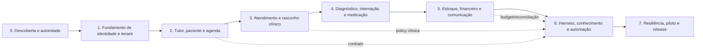

# CVG-Corp — Plano de execução recuperável

**Tipo:** ExecPlan documental para a futura implementação

**Estado:** PLAN; nenhum milestone de código foi iniciado.

Este plano é o dono da sequência, progresso, dependências e recuperação. O PRD é o dono do WHAT; a arquitetura e os contratos são o dono do HOW; o documento 06 é o dono da estratégia de prova.

## 1. Objetivo e restrições

Construir em fatias verticais um programa de gestão veterinária com fonte transacional própria e um runtime de IA governado pelo DeepSeek Harness.

Nesta fase, a única ação permitida é produzir documentação em `harness-corp/docs/`. Não executar implementação, migração, provisionamento, deploy, alteração de segredo ou integração externa.

## 2. Estado confirmado em 2026-09-07

- Fontes corporativas de harness foram inspecionadas e suas limitações registradas.
- DeepSeek Harness foi inspecionado no commit `6454e3270642c3a7551dcae4f7447e4032febd77`; o repositório estava limpo.
- Quality Bar v1 foi congelado antes da redação do PRD/SPEC; a revisão controlada v1.1 adicionou gates de dados, isolamento, autorização, injeção, integração, budget, auditoria, continuidade e versionamento sem reduzir targets.
- PRD, arquitetura-alvo, domínio/dados/contratos, integração DeepSeek, segurança e operação foram documentados como `TARGET/PROPOSED`.
- Ainda não foram executados código, build, testes, profile dump, provider real, benchmark, red-team, restore ou deploy.
- As decisões U1–U15 continuam pendentes; elas impedem o gate de produto completo.

## 3. Grafo de milestones



As linhas tracejadas são dependências de contrato, não autorização para paralelizar mudanças em arquivos compartilhados.

## 4. Milestones e gates

### M0 — Descoberta, autoridade e contrato

**Objetivo:** decidir U1–U15, nomear owners e congelar o primeiro recorte P0.

**Entradas:** [`01-prd-cvg.md`](01-prd-cvg.md), [`02-arquitetura-alvo.md`](02-arquitetura-alvo.md), [`05-seguranca-privacidade.md`](05-seguranca-privacidade.md).

**Tarefas:** mapear fluxo real de uma unidade; revisar papéis e alçadas; inventariar dados; definir prontuário e assinatura; selecionar primeiro provider/ambiente; definir retenção, RTO/RPO/SLO e offline; nomear responsáveis de produto, clínica, segurança, privacidade e operação.

**Saída:** PRD aprovado, decision log, matriz de autorização, data inventory, acceptance baseline e `DISCOVERY_READY`/`PRODUCT_DEFINED`.

**Bloqueadores:** identidade do tenant, papel clínico, fonte do prontuário, operações de alto impacto e política de dados desconhecidas.

### M1 — Identidade, escopo, policy e auditoria

**Objetivo:** criar a base que nenhuma jornada pode contornar.

**Saída demonstrável:** usuário autenticado resolve organização/unidade/workspace; allow/deny server-side; audit ledger; policy version; break-glass controlado; revogação.

**Prova:** testes de cross-tenant/cross-workspace, role/action/resource/state, cache stale, revocation, auditoria sem segredo e restore da base.

**Gate:** `TECHNICALLY_SPECIFIED` para identidade e `VERIFIED` da fatia.

### M2 — Tutor, paciente e agenda

**Objetivo:** percorrer `cadastro → vínculo → agenda → check-in` com idempotência e sem dupla reserva.

**Saída demonstrável:** recepção opera com paciente correto, conflitos são claros e todos os efeitos têm receipt/audit.

**Prova:** concorrência de reserva, duplicidade de paciente, vínculo inválido, cancelamento, no-show, falha de integração e UX/acessibilidade.

### M3 — Atendimento e copiloto de documentação

**Objetivo:** percorrer `check-in → atendimento → contexto mínimo → draft → revisão → assinatura/adendo`.

**Saída demonstrável:** o copiloto não escreve diretamente no prontuário; o profissional vê fontes, edita e assina explicitamente.

**Prova:** draft não publicado, paciente errado, policy ausente, provider timeout, prompt injection, versão concorrente e replay de sessão.

### M4 — Diagnóstico, internação e medicação

**Objetivo:** representar pedidos/resultados, leitos/tarefas/handoffs e ordem/dispensação/administração.

**Saída demonstrável:** cada transição inválida é rejeitada; alta e administração têm autoria, tempo, lote/ordem e pendências.

**Prova:** out-of-order result, lote expirado, retry, tarefa em transferência, dupla administração, cancelamento e crash recovery.

### M5 — Estoque, financeiro e comunicação

**Objetivo:** ligar serviços/itens a ledger, estoque e mensagens sem misturar responsabilidades.

**Saída demonstrável:** saldo e cobrança reconciliam; mensagens usam destinatário/consentimento; estornos dependem de alçada.

**Prova:** webhook duplicado, resposta perdida, saldo negativo, estorno não autorizado, mensagem errada, outbox lag e quarentena.

### M6 — DeepSeek Harness, conhecimento e automação

**Objetivo:** montar profile/bundle CVG, agents, tools, policy, approval, budget, knowledge, jobs e telemetria.

**Saída demonstrável:** agente lê somente contexto autorizado, produz draft/proposta, pede approval para efeitos e deixa trilha de sessão + domínio.

**Prova:** `--dump-config`, smoke do bundle, tool schema/output, approval absent→deny, guard monotônico, provider credential, budget reservation, retrieval ACL, Code Mode/nested calls se habilitados, session flush/replay e kill switch.

**Limite:** não ativar shell, filesystem, web, MCP, subagentes ou `agent-team` apenas porque existem no motor; cada capability precisa de threat model e gate próprio.

### M7 — Resiliência, piloto e release

**Objetivo:** demonstrar qualidade AAA com workload, incident drill e autoridade de release.

**Saída demonstrável:** backup/restore, RTO/RPO/SLO, observabilidade e runbooks funcionam; piloto tem rollback e critérios de aborto.

**Prova:** carga W-A…W-H, p95/p99, failover, provider outage, policy stale, credential revoke, data restore, red-team, UX, acessibilidade e review independente.

**Gate:** `VERIFIED` integrado e, somente com autoridade/ambiente reais, `RELEASE_READY`.

## 5. Contratos de ownership para implementação

| Lane | Dono | Arquivos/responsabilidades | Não pode assumir |
|---|---|---|---|
| Domínio | equipe CVG | casos de uso, invariantes, repositórios e eventos | policy do harness ou UI como authz |
| API/BFF | equipe plataforma | wire, context, authz, errors e streaming | acesso direto a tabela sem caso de uso |
| Harness | equipe AI runtime | bundle/profile, plugins, tools, prompt, approval e session bridge | assinar/alterar domínio fora da porta |
| Integrações | equipe integração | outbox/inbox, adapters, webhook, receipt e reconciliação | confirmar efeito sem evidência externa |
| Dados/ops | equipe dados/SRE | schema, migrations, backup, restore, telemetry e runbooks | apagar produção ou relaxar isolamento |
| UX | equipe produto | superfícies por papel, draft/signed, acessibilidade e estados de falha | esconder falha ou usar UI como autorização |

Cada lane deve receber uma task contract com paths disjuntos, acceptance IDs, comando, fixture, digest e retorno `IMPLEMENTED`; nenhum worker aprova o próprio trabalho.

## 6. Checks futuros por milestone

Os nomes são planejados até o repositório de implementação existir:

```text
M1: authz-contract, tenant-negative, audit-redaction, revoke-cache
M2: appointment-concurrency, patient-dedup, check-in-e2e
M3: clinical-state, draft-signature, session-replay, prompt-injection
M4: order-result-link, medication-idempotency, handoff-recovery
M5: stock-ledger, payment-reconcile, webhook-idempotency, message-consent
M6: harness-build, profile-dump, tool-pipeline, approval-deny,
    budget-reservation, retrieval-acl, credential-rotation, kill-switch
M7: load-workload, backup-restore, chaos-recovery, accessibility,
    independent-security-review, final-critic
```

Um check só vira `PASS` quando executado no artifact exato, com ambiente, fixture, comando, resultado, hash e limitação registrados. Existência do nome do check não é evidência.

## 6.1 Cobertura dos gates v1.1

Os critérios abaixo são release-blocking e têm uma fatia de execução explícita. O owner é responsável por preparar a prova, não por aprovar sozinho o resultado.

| Critério | Milestone/owner | Check mínimo | Falha bloqueadora |
|---|---|---|---|
| `EV-01` | M0 — produto/arquitetura | claim ledger, source/hash, estado e fingerprint do artifact | capacidade proposta aparece como implementada/testada sem evidência |
| `DATA-02` | M0/M7 — dados/privacidade | lifecycle sintético DB→object→vector→session→cache→backup→provider→telemetry | cópia sem owner, retenção, expurgo ou reconciliação |
| `DATA-03` | M1/M7 — segurança/ops | device-loss, revoke, wipe, update e restore | cache local sobrevive a revogação ou não é recuperável com segurança |
| `ISO-01` | M1 — domínio/dados | negative cross-scope em cada store, export e backup | actor/tenant consegue observar ou alterar B |
| `ISO-02` | M1/M6 — identidade/AI | policy/session/credential binding, TTL, hash e revocation epoch | sessão/credencial antiga mantém privilégio |
| `AUTH-02` | M1/M7 — segurança/ops | matriz Admin Master/suporte/break-glass e revisão de acesso | exceção sem caso, motivo, janela, aprovação ou trilha |
| `AUTH-03` | M3/M6 — AI/segurança | mutar args, recurso, estado, policy ou expiração entre approval e dispatch | chamada alterada executa |
| `INJ-01` | M6 — AI/segurança | red-team em documento, memória, RAG, MCP, e-mail e web | conteúdo não confiável muda autoridade |
| `INJ-02` | M6 — AI/segurança | bypass em native/local/MCP/skill/Code Mode/nested | alguma origem não passa pela admission comum |
| `INT-01` | M4/M5 — integração | timeout, retry, crash, resposta perdida e `OUTCOME_UNKNOWN` | efeito externo duplicado ou falso sucesso |
| `INT-02` | M5 — integração | contrato individual de identidade, versão, webhook, erro e reconciliação | adapter sem escopo, assinatura ou recuperação definida |
| `BUD-01` | M6 — AI/dados | reserva atômica, hard stop, nested, retry e modalities | dispatch ocorre sem reserva ou após limite |
| `BUD-02` | M6/M7 — dados/financeiro | crash, late/out-of-order usage, duplicate e settlement | ledger duplica consumo/cobrança ou perde discrepância |
| `AUD-01` | M1/M7 — segurança/ops | perda de telemetry sink e leitura do audit ledger | auditoria crítica depende de telemetry best-effort |
| `AUD-02` | M3/M6 — segurança | known-good/known-bad de redaction e inspeção de payload | segredo/PII desnecessário é persistido |
| `REL-03` | M7 — SRE | fault injection de timeout, cancelamento, retry, backpressure e poison | mecanismo sem limite ou retry cego |
| `REL-04` | M7 — SRE | benchmark W-A…W-H com p50/p95/p99 e concorrência | escala aprovada por média sem cauda |
| `OBS-02` | M6/M7 — ops | collector indisponível, perda, duplicação, retenção e redaction | telemetry vaza, perde contexto ou é confundida com auditoria |
| `AI-01` | M6 — AI/clinical | registry, admission, avaliação, rollback e kill switch | artefato não versionado ou não revogável executa |
| `VER-01` | M0/M7 — dados/runtime | mixed-version replay, migration, restore e evento desconhecido | restore altera semântica ou libera ambiente inconsistente |

Os critérios v1 (`DOC-01`, `DOC-02`, `DOC-03`, `ARC-01`, `ARC-02`, `DATA-01`, `SEC-01`, `CLIN-01`, `OPS-01`, `AAA-01`, `AAA-02`, `AAA-03`, `TRACE-01`, `PLAN-01`) permanecem cobertos pelos checks anteriores e pela matriz AAA. Qualquer mudança de milestone, owner ou check exige atualização simultânea do documento 08.

## 6.2 Cobertura individual dos gates v1

Para manter o plano machine-resolvável, cada gate original também possui um check, owner e falha de parada próprios.

| Critério | Milestone/owner | Check mínimo | Falha bloqueadora |
|---|---|---|---|
| `DOC-01` | M0 — lead/docs | source inventory, hash, estado e claim provenance | decisão de produto/engine sem origem verificável |
| `DOC-02` | M0 — produto/clínica | PRD com ator, sucesso, negação, recuperação e aceite por UC | jornada material sem erro/recovery ou alçada |
| `ARC-01` | M0/M1 — arquitetura/domínio | boundary review e dependências sem fonte dupla de verdade | harness assume prontuário, estoque ou ledger |
| `ARC-02` | M6 — AI/runtime | matriz seam→adapter, profile e capability dump | API futura é descrita como atual |
| `DATA-01` | M0/M1 — dados/privacidade | entity/owner/invariant/lifecycle review | entidade sem escopo, retenção/expurgo ou prova planejada |
| `SEC-01` | M1/M6 — segurança | threat model + actor/action/resource/condition matrix | caminho sem default deny, egress ou auditoria |
| `CLIN-01` | M3/M4 — clínica/AI | draft/signature/approval known-good/known-bad | IA executa ato de alto impacto sem humano autorizado |
| `OPS-01` | M7 — SRE/ops | health/readiness, SLO/RTO/RPO, backup/restore e runbook review | operação não é mensurável ou recuperável |
| `AAA-01` | M3/M7 — clínica/produto | cenários de assistência segura e aceite A1 | segurança clínica depende apenas de prompt |
| `AAA-02` | M1/M5/M7 — domínio/dados | isolamento, integridade, ledger, segregação e restore | dado/efeito administrativo não reconcilia |
| `AAA-03` | M6/M7 — AI/runtime | policy, tools, budget, approval, knowledge, telemetry e kill switch | aceleração não é controlável/reversível |
| `TRACE-01` | M0 e cada milestone — lead | matriz requisito→contrato→risco→prova com owner/estado | requisito crítico sem vínculo ou stale não detectado |
| `PLAN-01` | M0 e cada milestone — lead | task contract, dependências, comando, fixture, digest e recovery | milestone não pode ser retomado ou verificado |
| `DOC-03` | abertura/fechamento de cada rodada — lead | fingerprint pré/pós + `git status` do motor + escopo de paths | mutação fora de `harness-corp/docs/` ou sentinel ausente |

## 7. Recuperação e replanejamento

Ao retomar: ler `README.md`, `00-quality-bar-v1.md`, este plano, o documento 08, o estado do workspace e o commit do motor; verificar hashes dos inputs; comparar o artefato atual com o último checkpoint; reabrir qualquer critério cujo contrato, schema, bundle, policy, provider ou fonte tenha mudado.

Se uma task parou depois de enviar efeito externo, classificar como `OUTCOME_UNKNOWN` e reconciliar antes de retry. Se parou antes de commit, repetir somente comando idempotente. Se o motor mudar `SESSION_FORMAT_VERSION`, evento, API ou composição, parar o milestone e executar migração/replay de compatibilidade antes de continuar.

## 8. Próxima ação executável

Realizar o workshop de M0 para decidir U1–U15 e reduzir o primeiro recorte P0 a uma unidade, uma jornada e um conjunto de papéis. Depois atualizar PRD, data inventory, matriz de autorização, contratos e Quality Bar com as decisões confirmadas.
