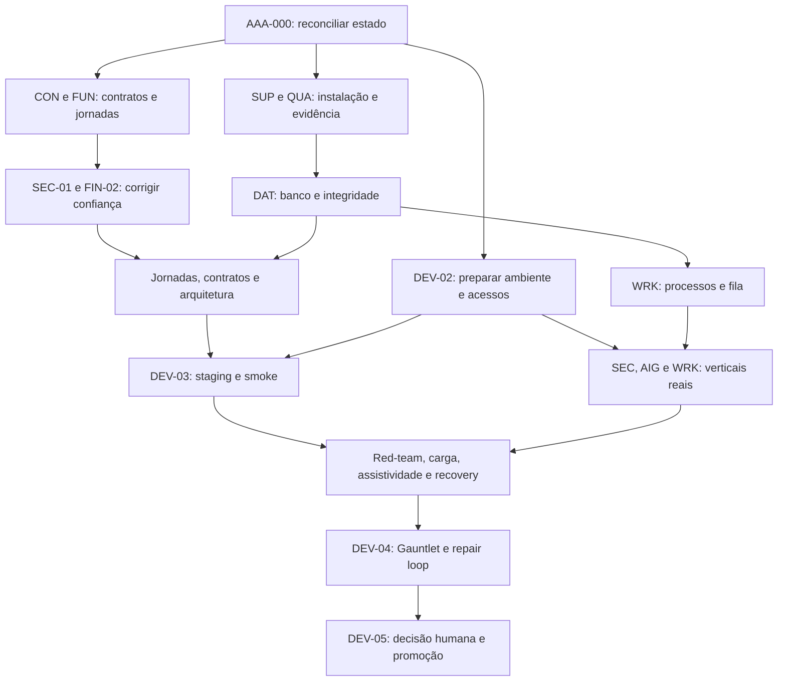

# Roadmap por marcos e resultados

Os marcos M0–M5 são ondas de planejamento, **não as fases normativas F0–F38**. O DAG em `backlog.json` determina pré-requisitos técnicos; cada tarefa respeita dependências e reservas, mesmo que apareça no mesmo marco que outra. Preparação de um marco posterior pode começar cedo se seus pré-requisitos forem atendidos; a passagem do marco exige todos os contratos obrigatórios daquele resultado.

## Sequência executiva

| Marco | Resultado demonstrável | Entregas principais | Critério de saída |
|---|---|---|---|
| M0 — Base, contratos e preparação | Outro agente consegue iniciar uma tarefa sem inferir escopo, estado ou dependência | AAA-000, ARC-01, CON-01, FUN-01, FIN-01, QUA-01/02, SUP-01, DEV-02, DOC-01 | Estado reconciliado; fixtures determinísticas; build limpo; contratos iniciais e recursos externos catalogados. DEV-02 pode permanecer bloqueado quanto a acesso real, explicitando que M0 operacional é parcial. |
| M1 — Confiança do usuário | Logout e financeiro corrigidos; respostas inválidas rejeitadas; banco local real testado | SEC-01, FIN-02, CON-02, AIG-01, UX-01, QUA-03, DAT-01, PER-01, DEV-01 | Reproduções A01/A02 viram regressões corretas; CI/local sem falha mascarada; baseline e escopos autorizados. |
| M2 — Jornadas e núcleo íntegro | Estoque/clínico/financeiro completam contratos; workers e dados suportam concorrência | FUN-02/03, FIN-04, SEC-02, DAT-02/03, WRK-01/02, ARC-02/03, CON-03, UX-02, A11Y-01, SUP-02, DOC-02 | Jornadas essenciais implementadas; regras pendentes resolvidas para aceite integral; CAS/RLS/retry/imutabilidade provados; contratos e matriz automática aprovados. |
| M3 — Operação real em ambiente de teste | Mesmo artefato opera com identidade, providers, TLS, telemetria e backup | SEC-03, AIG-02, WRK-03, OPS-01/02, DAT-04, PER-02, DEV-03 | Verticais externas e restore reais; sem credencial fixture promovida; shutdown/restart/receipt demonstrados. |
| M4 — Adversidade e uso real | Sistema mantém integridade sob falha, pressão e uso assistivo | SEC-04, AIG-03, FIN-03, PER-03, OPS-03, UX-03, A11Y-02/03 | Red-team sem high/critical; carga/RTO/RPO medidos; alertas/runbooks observados; jornadas e acessibilidade avaliadas com humanos. |
| M5 — Candidato e decisão | Dossiê completo do candidato permite decisão de promoção | SUP-03, DOC-03, DEV-04/05 | 25 gates e F0–F38 com evidência atual, 22 dimensões acima do limiar, Overall ≥97, críticos e atestação humana válidos. |

## DAG resumido

Este desenho mostra frentes; somente as dependências por ID no catálogo autorizam dispatch.

## Primeiras janelas de trabalho

| Janela | Lead | Builder A | Builder B | Crítico |
|---|---|---|---|---|
| 0 | AAA-000, leitura de estado e reserva dos arquivos | Ainda não inicia | Ainda não inicia | Não é necessário antes de existir candidato |
| 1 | Prepara mapa de recursos e inputs DEV-02 sem editar áreas dos builders | SUP-01, manifests/lockfile | QUA-01, fixture/verificador | Revisa entregas que chegarem; não revisa diff em mutação |
| 2 | Integra e reserva contratos; organiza inventário FUN-01 | QUA-02 após SUP-01/QUA-01 | CON-01 em arquivos exclusivos | Revisa testes negativos e compatibilidade |
| 3 | Integra FUN-01 e FIN-01; agenda banco/CI | SEC-01 após CON-01 | DAT-01 após SUP-01 | Reproduz logout/banco conforme candidatos retornam |
| 4 | Garante ausência de colisão em testes e contratos | FIN-02 após FIN-01 | AIG-01 em policy/tools | Revisa saldo e governança |

ARC-01, DOC-01 e preparação de DEV-02 usam a capacidade livre e caminhos reservados. Não compartilhar genericamente `docs/adr/`: reserve nomes concretos antes de escrever. Se um builder ficar esperando decisão, não conta como trabalho ativo; use a vaga em outra tarefa pronta.

## Paralelismo e pontos de integração

- **SUP-01 e QUA-01** podem escrever em paralelo: manifests/lockfile versus fixture/verificador. O reviewer usa snapshot imutável da entrega terminada.
- **SEC-01 e FIN-02** têm features distintas, mas ambos podem alterar E2E e composição. Só paralelizar se o Lead fixar arquivos de teste separados e reservar `App.tsx` para SEC; caso contrário serializar.
- **DAT-02/03, WRK-02 e ARC-03** usam persistência. Contratos e recursos no catálogo forçam exclusão; worktrees não eliminam a necessidade de ordem de integração.
- **AIG-02 e WRK-03** podem usar ambientes de provider/IA separados, com segredos de teste distintos e nenhum handler compartilhado sendo modificado.
- **UX-02 e A11Y-03** alteram styles/components: executar sequencialmente. Testes assistivos após os componentes integrados.
- **Carga, red-team e restore** não compartilham banco ou staging em mutação. Clones de ambiente ou janelas reservadas são pré-requisitos.
- **DEV-04/05** avaliam um candidato congelado. Não realizar merges concorrentes, “pequenas correções” ou atualização de artefatos ligados ao candidato durante julgamento.

## Caminhos que provavelmente controlam o prazo

1. SUP/QUA → DAT → jornadas/worker → extrações → staging → pressão/restore → revisão final.
2. DEV-02 → identidade real → DeepSeek/provider → falhas/settlement → red-team → revisão final.
3. Jornadas/UX → matriz de browsers → operador assistivo/usuários → reteste → revisão final.

São caminhos qualitativos derivados do DAG. O caminho crítico com prazo só será calculado após medir esforço e disponibilidades em M0; a espera por acesso/operador pode superar a implementação. O Lead acompanha tarefa pronta, WIP, bloqueio, idade do bloqueio, taxa de retrabalho e defeitos reabertos, sem usar número de commits como produtividade.

## Gates e política de replanejamento

Um marco não é aprovado por encerrar cards: é preciso executar a demonstração contra o candidato integrado, com evidências e limitações. Falha obrigatória implica FAIL ou marco parcial; NOT_RUN nunca satisfaz gate. Os testes usados para reproduzir os dois defeitos na auditoria antiga precisam inverter a expectativa para exigir comportamento corrigido; não copiar o “pass” que confirma o bug como teste de aceite.

Ao descobrir alteração de contrato, tarefa L grande demais, ambiente inválido ou um novo achado material: registrar a evidência, dividir/refinar a tarefa antes de dispatch, manter dependências, atualizar o plano por decisão datada e invalidar a prova afetada. Não criar meta menor para encerrar o marco.

O gate técnico de DEV-04 pode ser preparado e revisado com F38 pendente; nesse ponto `verify:triplo-aaa` ainda deverá indicar inelegibilidade. Somente DEV-05 adiciona a decisão humana real e permite avaliar o gate integral. Nenhum ciclo artificial DEV-04→aprovação→DEV-04 é exigido para pedir a decisão; alterações solicitadas pelo humano reabrem o candidato.
