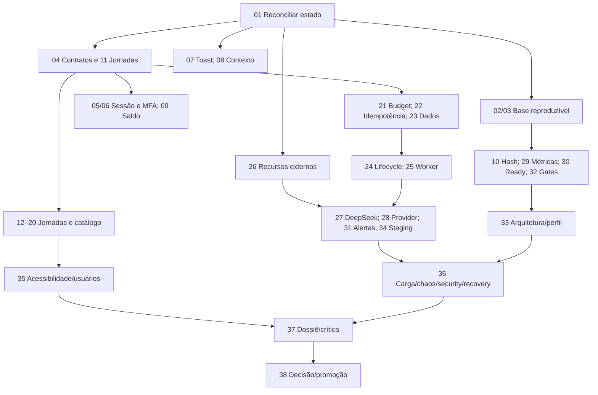

# Roadmap por resultados

M0–M5 são ondas deste programa, não as fases normativas F0–F38. O DAG do [catálogo](backlog.json) governa execução; marcos não são barreiras artificiais para tarefas independentes. Uma tarefa de M3 pode avançar antes do encerramento de M2 se suas dependências e recursos estiverem prontos.

| Marco | Tarefas | Demonstração de saída |
|---|---|---|
| M0 — Base e contratos | 01,02,03,11,26 | Retomada idempotente sem duplicação; instalação/fixture isoladas; matriz CTA→resultado; recursos externos com donos e condição de disponibilidade |
| M1 — Confiança e gates | 04–10,29,30,32 | Logout/MFA/saldo/toast/contexto corrigidos; login limitado; métricas bounded; readiness atual; gates rejeitam casos ruins |
| M2 — Jornadas e integridade | 12–23 | Cadastro→recepção→clínico; diagnóstico/internação/estoque/financeiro; IA com histórico/registry/budget; claims e fontes em PostgreSQL real local |
| M3 — Operação integrada | 24,25,27,28,31,33,34 | Lifecycle e restore reconciliado; workers multiprocesso; DeepSeek/provider/secrets reais; alertas entregues; artefato em staging com provenance |
| M4 — Adversidade e uso | 35,36 | Jornadas assistivas e usuários representativos; workloads/carga/chaos/red-team; backup/runbooks executados e RTO/RPO medidos |
| M5 — Candidato e decisão | 37,38 | Dossiê sem claim stale, reavaliação/críticos e gates; decisão humana genuína e promoção somente autorizada |

Os números acima abreviam `AUD13-`. A tarefa 18 inclui decisões financeiras específicas; não bloqueia a correção PAID da 09. A26 entrega preparação local mesmo se disponibilidade externa continuar pendente; dependentes só executam a etapa externa após disponibilidade/autoridade observadas.

O diagrama é síntese, não substitui dependências individuais de `backlog.json`.

## Primeiras janelas executáveis

| Janela | Lead | Builder A | Builder B | Revisão |
|---|---|---|---|---|
| 0 | 01 reconcilia estado e reservas | Não inicia mutação | Não inicia mutação | Confere mapa sem alterar estado |
| 1 | 11 inventaria jornadas e 26 prepara recursos | 02 dependências/runner | 03 fixture snapshot | Crítico revisa resultados completos |
| 2 | Reserva sessão/API e contratos | 04 consumidor semântico | 07 toast com testes próprios | Gates negativos e render após clique |
| 3 | Integra contratos; coordena paths | 05 logout | 29 telemetria, após 11 | Reproduções e boundary review |
| 4 | 30 readiness em janela própria de API | 06 MFA após sessão integrada | 08 contexto/indicadores em arquivos disjuntos | Sessão normal/challenge e geometria |
| 5 | 32 gates após 02/03 | 09 saldo após 04 | 10 hashing só sem disputa pela API/domínio | Saldo/limites/compatibilidade e regressão |

Exemplos condicionais: builder só começa se dependências reais forem satisfeitas e os arquivos exatos não conflitarem com Lead/outro builder. 05/06 compartilham sessão; 09/10/30 podem compartilhar app.ts; serialize ou atribua integração desse arquivo a um único owner. A02 também envolve tests/scripts: reservar arquivos distintos de 03 antes do paralelo.

## Caminhos de maior risco de prazo

- Sessão/contratos→cadastro→recepção→clínico→exames/internação→avaliação assistiva.
- Idempotência→persistência→lifecycle/workers→integrações→chaos/recovery.
- Disponibilidade de staging/identidades/modelo/provider/sink→prova externa→Gauntlet final.

Não há data prometida enquanto esforço por fatia e disponibilidade externa não forem medidos. Reestimar após M0 e após três tarefas implementadas/revisadas, incluindo retrabalho, integração e espera por decisões. Não remover tarefas do caminho para cumprir uma estimativa inicial.

## Replanejamento e passagem

Falha obrigatória reabre critério e invalida a evidência afetada. Mudança de regra ou contrato exige registro datado e refinamento das tarefas dependentes; nunca reduzir limiar para passar. Mudança de candidato após carga/browser/CI exige reteste da superfície afetada e novo vínculo de prova.

AUD13-37 pode entregar candidato técnico pronto para decisão com F38 pendente; `verify:triplo-aaa` deve continuar reprovando nesse ponto. AUD13-38 registra decisão humana real somente depois do dossiê concreto. Este planejamento não concede autorização de release.
